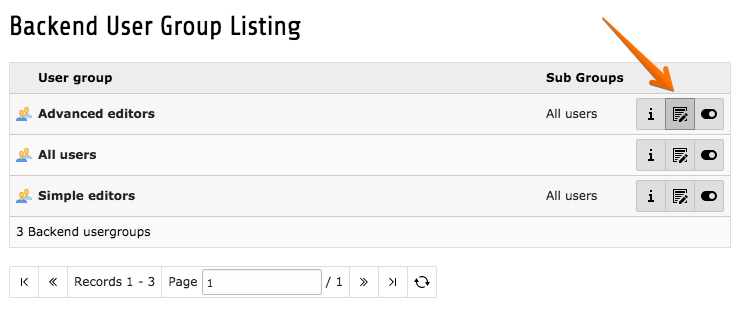
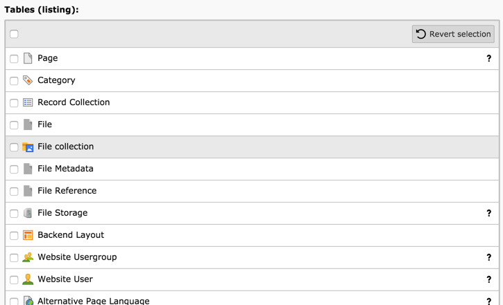
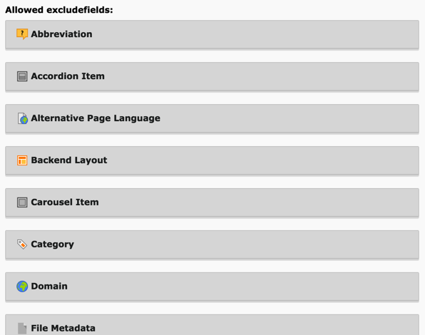
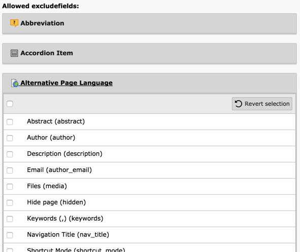
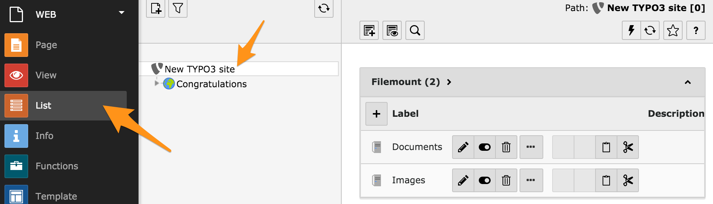
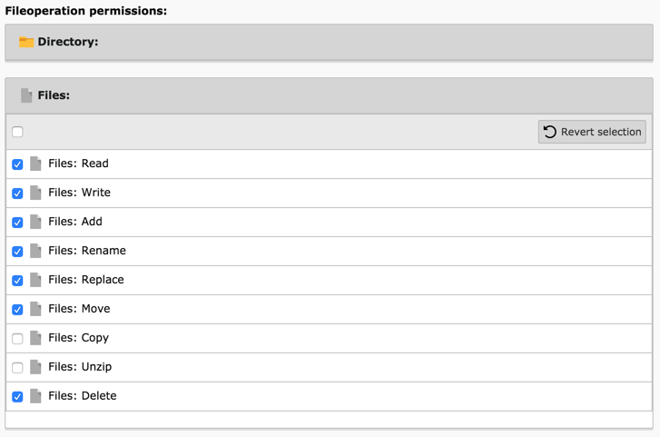

.. include:: /Includes.rst.txt

.. _permissions:
.. _setting-up-user-permissions:

===========================
Настройка прав доступа пользователей
===========================

Рассмотрим управление правами пользователей с помощью редактирования группы пользователей "Advanced editors".

.. _general:

Общее / General
=======

На вкладке "Общие" можно отредактировать название группы и написать краткое описание. Как уже упоминалось, права доступа из подгрупп будут наследоваться текущей группой.

.. figure:: ../../Images/ManualScreenshots/UserManagement/BackendBackendGroupEditGeneralTab.png
   :alt: Содержимое вкладки "Общее" при редактировании группы внутренних пользователей

.. note::

   Настройка разрешений – это не только права доступа.

   Кроме того, это может помочь навести порядок во внутреннем интерфейсе, обеспечив пользователям внутреннего интерфейса доступ только к тем модулям, которые им необходимы.

.. _access-lists:
.. _include-access-lists:

Списки доступа / Access Lists
============

На вкладке "Списки доступа" / "Access Lists" задается большинство разрешений. Все поля подробно описаны ниже.

.. _modules:

Модули / Modules
-------

Первое поле используется для определения того, к каким модулям должны иметь доступ члены группы. Это напрямую влияет на то, что будет отображаться в меню модулей для пользователей внутреннего интерфейса.

.. figure:: ../../Images/ManualScreenshots/UserManagement/BackendBackendGroupEditModules.png
   :alt: Выбор модулей для групп внутренних пользователей

.. _tables:
.. _tables-modify:

Таблицы / Tables
------

Второе поле позволяет выбрать таблицы, которые разрешено просматривать членам групп ("Таблицы (просматривать)" / "Tables (listing)"). И следующее поле - то же самое, но для таблиц, которые могут быть изменены ("Таблицы (редактировать)" / "Tables (modify)").

.. _page-types:

Типы страниц / Page Types
----------

Эти поля могут ограничивать доступность типов страниц для членов группы. Пояснения по поводу различных типов страниц можно найти в :ref:`Руководстве для редакторов: <t3editors:pages-types>`.

.. figure:: ../../Images/ManualScreenshots/UserManagement/BackendBackendGroupEditPageTypes.png
   :alt:

.. _allowed-excludefields:

Разрешённые поля-исключения / Allowed Excludefields
---------------------

При определении полей таблиц в TYPO3 существует возможность пометить их как "исключенные". Такие поля никогда не будут видны пользователям внутреннего интерфейса (кроме администраторов, разумеется), если им не будет явно предоставлен доступ к ним. Данное поле предназначено для предоставления такого доступа. Оно отображает список всех таблиц и исключенных из них полей.

Щелкните по названию таблицы, чтобы развернуть список ее полей, и выберите поля, установив флажки.

.. _explicitly-allow-deny-field-values:

Явно разрешить/запретить значения полей / Explicitly Allow or Deny Field Values
-------------------------------------

Для некоторых полей можно установить более тонкие разрешения на фактические значения, допустимые для этих полей. В частности, это относится к полю "Содержимое страницы: Тип" / "Page content: Type", определяющего тип элемента содержимого, который затем может быть определен членами группы.

Как и в случае со списком исключенных полей, это поле появляется внутри свернутых групп. Для внесения изменений необходимо развернуть одну группу.

.. figure:: ../../Images/ManualScreenshots/UserManagement/BackendBackendGroupEditAllowDeny.png
   :alt: Настройка разрешений для значений типов содержимого на страницах

Ограничить до языков / Limit to Languages
------------------

На многоязычном сайте можно также ограничить доступ пользователей к определенному языку или набору языков. Это можно сделать с помощью последнего поля вкладки "Списки доступа".

.. figure:: ../../Images/ManualScreenshots/UserManagement/BackendBackendGroupEditLanguages.png
   :alt: Настройка ограничения на языки

.. _mounts:

Точки доступа и рабочие области / Mounts and Workspaces
=====================

На следующей вкладке представлены очень важные поля, определяющие, на какие части дерева страниц и файловой системы члены группы могут получить свои права.

Здесь мы рассмотрим только монтирование. Подробную информацию о рабочих пространствах можно найти в :doc:`руководстве по расширению <ext_workspaces:Index>`.

.. _db-mounts:

Доступ к БД / DB Mounts
---------

Монтирования DB (монтирования базы данных) используются для ограничения доступа пользователя только к некоторым частям дерева страниц. Каждое монтирование соответствует странице в дереве. Пользователь будет иметь доступ только к этим страницам и их подстраницам.

.. figure:: ../../Images/ManualScreenshots/UserManagement/BackendBackendGroupEditDBMounts.png
   :alt: Выбор точек монтирования БД для групп

Дополнительно :ref:`Разрешения для страниц <page-permissions>`.

Для того чтобы эти настройки наследовались назначенными пользователями, необходимо активизировать флажок "Монтировать из групп" / "Mount from groups" для параметра "Монтирование БД" / "DB Mounts" в записи `be_users` этого пользователя. Эта запись находится в модуле "Список" на корневой странице и в модуле "Внутренние пользователи" / "Backend User".

.. _file-mounts:

Точки доступа к файлам / File Mounts
-----------

Точки доступа к файлам похожи на подключения к БД, но используются для управления доступом к файлам. Основное отличие заключается в том, что записи подключения файлов должны быть сначала определены администратором. Они располагаются на корневой странице:

Затем их можно выбрать при редактировании группы пользователей внутреннего интерфейса:

.. figure:: ../../Images/ManualScreenshots/UserManagement/BackendBackendGroupEditFileMounts.png
   :alt: Выбор из доступных точек доступа к файлам

.. note::

   Определение записей точек доступа к файлам также зависит от так называемых файловых хранилищ. Подробнее эта тема раскрывается в главе :ref:`File Abstraction Layer в руководстве TYPO3 Explained Manual <t3coreapi:fal>`.

Для того чтобы эти настройки наследовались назначенными пользователями, необходимо активизировать флажок "Монтировать из групп" для параметра "Доступ к файлам" в записи `be_users` определенного пользователя. Эта запись находится в модуле "Список" на корневой странице и в модуле "Внутренние пользователи".

.. _file-permissions:

Разрешения для операций с файлами / Fileoperation Permissions
-------------------------

Предоставление доступа к файлам - это еще не все. Необходимо разрешить специфические операции над файлами и каталогами. Для этого используется следующее поле. Выберите "Каталог" / "Directory" или "Файлы" / "Files" и расставьте флажки.

.. _category-permissions:

Категория точки монтирования / Category mounts
---------------

Можно указать категории, которые пользователь может прикрепить к записи базы данных, выбрав разрешенные категории в поле :guilabel:`Категория точки монтирования` / :guilabel:`Category mount`. Если в поле Категория точки монтирования / category mount не выбрана ни одна категория, то доступны все категории.

Категории точек монтирования влияют только на то, что могут быть прикреплены к записям с определенными категориями. Все категории видны в модуле Список, если пользователь имеет доступ к папке, в которой хранятся записи `sys_category`.
