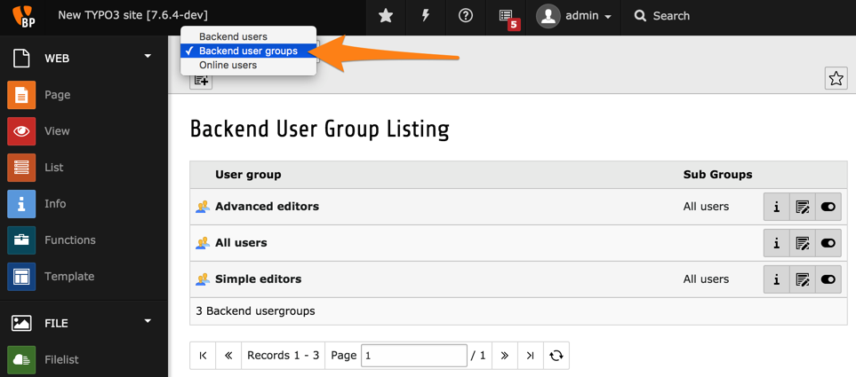
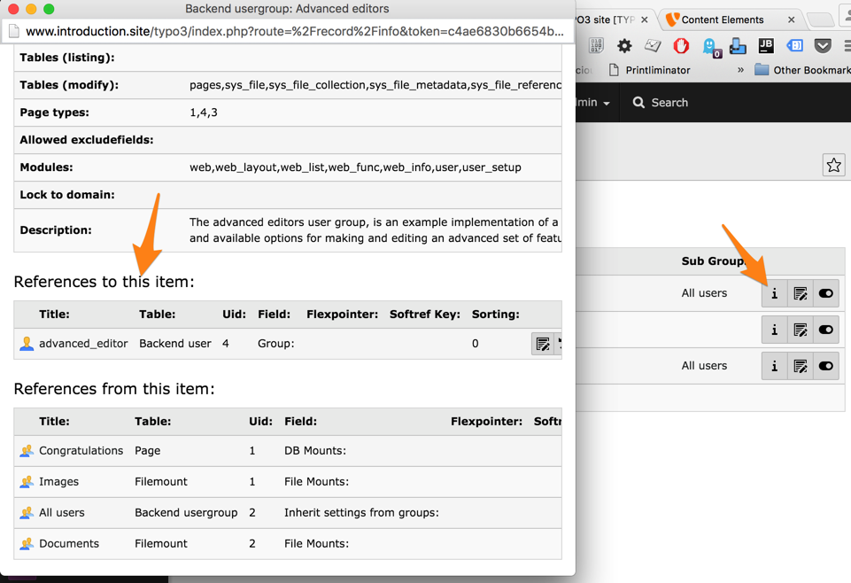

.. include:: /Includes.rst.txt

.. _groups:

======
Группы
======

Несмотря на возможность изменить права доступа для каждого пользователя, настоятельно рекомендуется использовать группы. Как и для пользователей, существуют "Группы внутренних пользователей" и "Группы пользователей сайта".

В этой главе представлен небольшой обзор групп пользователей внутреннего интерфейса. В следующей главе рассмотрим, как изменить права доступа пользователей с помощью групп.

Группы внутренних пользователей можно просмотреть и в модуле **СИСТЕМА > Внутренние пользователи** / **SYSTEM > Backend users**:

Видны две группы, соответствующие пользователям (" simple" и "advanced").

Чтобы узнать, в какой группе состоит каждый пользователь, выберите значок "информация". Откроется всплывающее окно с подробной информацией о группе. Прокрутите страницу вниз, пока не найдете раздел "Ссылки на этот элемент:" / "References to this item:". Здесь отображается список пользователей внутреннего интерфейса, входящих в данную группу.

