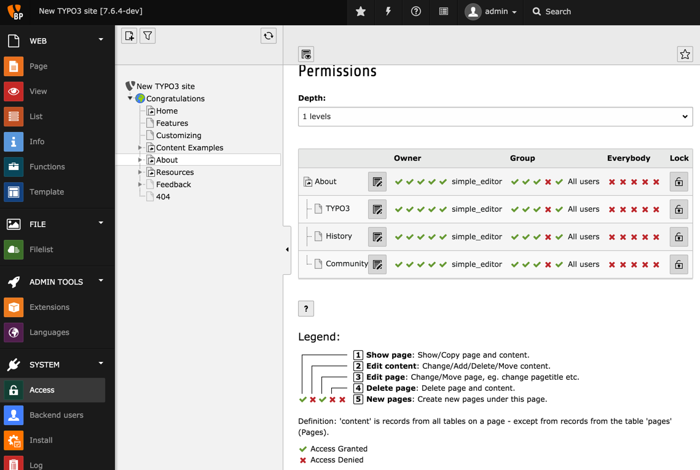
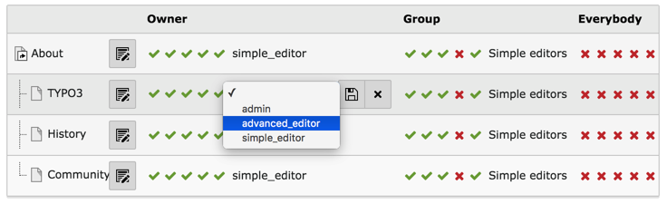
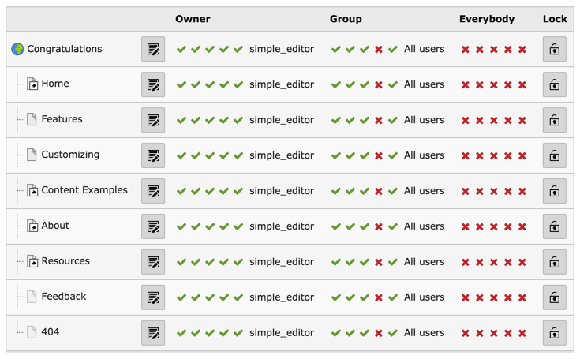

.. include:: /Includes.rst.txt

.. _page-permissions:

================
Права доступа к странице
================

:ref:`Доступ к БД <db-mounts>` - это еще не вся история о доступе к страницам. Пользователи и группы также должны иметь права на выполнение операций над страницами, таких как просмотр, редактирование или удаление.

Управление этим осуществляется с помощью модуля **СИСТЕМА > Доступ** / **SYSTEM > Access**:

Каждая страница имеет владельца, пользователя, а также принадлежность к группе. Права могут быть назначены владельцу, группе или всем. Это хорошо знакомо пользователям Unix.

Если нужно изменить разрешение, просто щелкните на соответствующем значке, и состояние разрешения изменится. Чтобы изменить владельца или группу данной страницы, щелкните на имени владельца или группы, после чего появится небольшая форма.

Также можно рекурсивно изменить владельца, группу и разрешения даже для всего дерева страниц. Давайте перейдем домашнюю страницу, щелкнув на странице "Congratulations" в дереве страниц. Теперь снова щелкните на странице "Congratulations" в модуле *Доступ* / *Access*. Должно появиться следующее:

.. figure:: ../../Images/ManualScreenshots/UserManagement/BackendAccessModuleChangeRecursively.png
   :alt: Подготовка к рекурсивному изменению группы на всем дереве страниц

Выбрав в качестве группы "Все пользователи", а затем "Установить рекурсивно 3 уровня" в раскрывающемся списке "Глубина", мы назначим **все** страницы в дереве страниц группе "Все пользователи".

Действительно, в этом есть смысл, поскольку группа " All users" является подгруппой как "Simple editors", так и "Advanced editors". Таким образом, обе группы будут иметь одинаковые права на дерево страниц. Однако, поскольку у них разные монтирования БД, они не будут иметь доступа к одному и тому же набору страниц.

