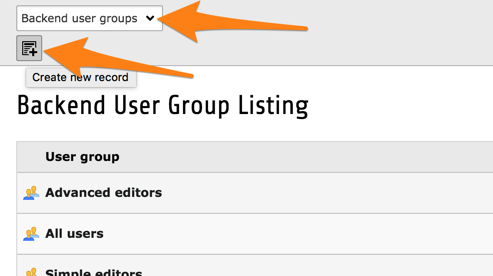
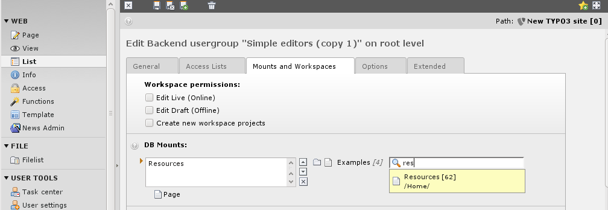
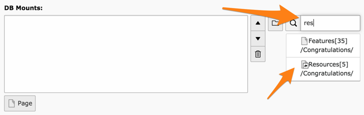
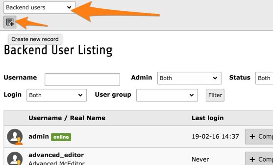
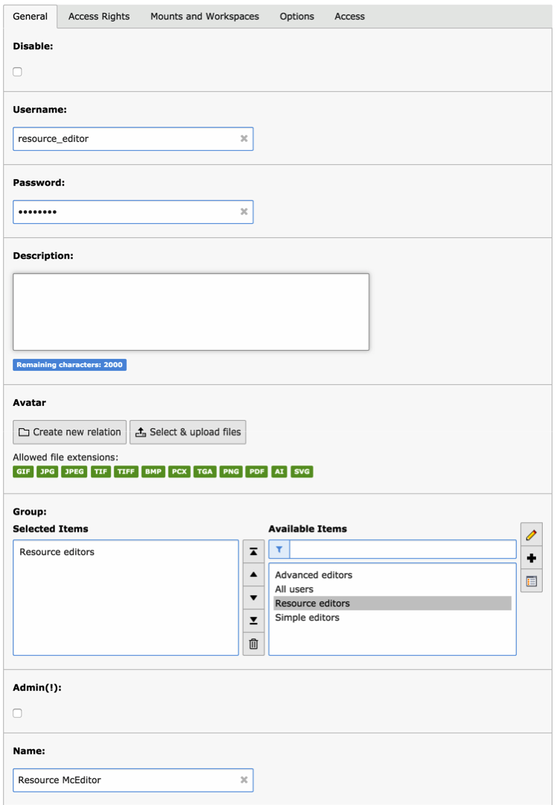
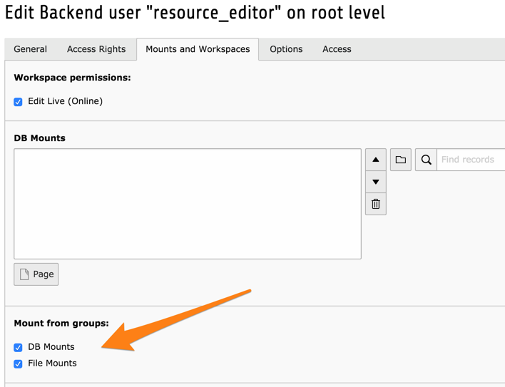
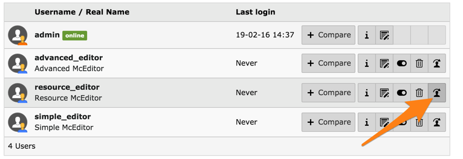
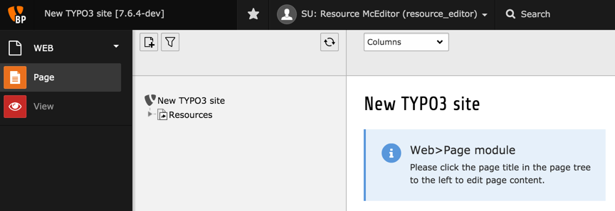

.. include:: /Includes.rst.txt

.. _setup-user:
.. _creating-a-new-user-for-the-introduction-site:

=================
Настройка пользователя
=================

Чтобы изучить последние детали настройки пользователя внутреннего интерфейса, а также в качестве упражнения, в этой главе будет рассмотрен процесс создания нового пользователя. Для повышения интереса создадим также новую группу пользователей.

.. _step-create-a-new-group:

Шаг 1: Создание новой группы
==========================

Создадим новую группу пользователей с помощью модуля *Доступ* / *Access*.

Начните с ввода названия ("Resource editors"), опционально - описания и выберите в качестве подгруппы "All users".

Давайте не будем усложнять дальнейшие разрешения. Попробуйте выполнить следующие действия:

- Для **Модулей** достаточно выбрать "Веб > Страница" / "Web > Page" и "Веб > Просмотр" / "Web > View".
- Для **Tables (listing)** и **Tables (modify)**, выберете "Page" и "Page content".
- Для **Page types**, выберете "Standard".

и сохраните.

Перейдите на вкладку "Mounts and workspaces" и выберите страницу "Resources" в качестве DB mount. Для этого в правой части поля мастера начните вводить слово "Res". Появятся предложения, из которых можно выбрать страницу "Resources".

Все остальное проигнорируем. Чтобы вернуться к списку групп, воспользуйтесь действием "Сохранить и закрыть".

.. _step-create-the-user:

Шаг 2: Создание пользователя
=======================

Аналогично тому, что мы делали ранее, создадим нового пользователя с помощью модуля *Access*.

Введите имя пользователя, пароль, членство в группе:

.. note::

   Если бы мы создавали нового администратора, то нам нужно было бы просто установить флажок "Admin (!)". Пользователям-администраторам не обязательно принадлежать к какой-либо группе, хотя это может быть полезно для разделения специальных настроек между администраторами.

Теперь переключитесь на вкладку "Mounts and workspaces" и убедитесь, что установлены параметры "Mount from Groups":

Таким образом, монтирование БД и файлов берется из группы (групп), в которую входит пользователь, и не определяется на уровне пользователя.

Сохраните и закройте запись. Проверим результат нашей работы, воспользовавшись рассмотренной ранее функцией симуляции пользователя.

Вы должны увидеть следующее:

