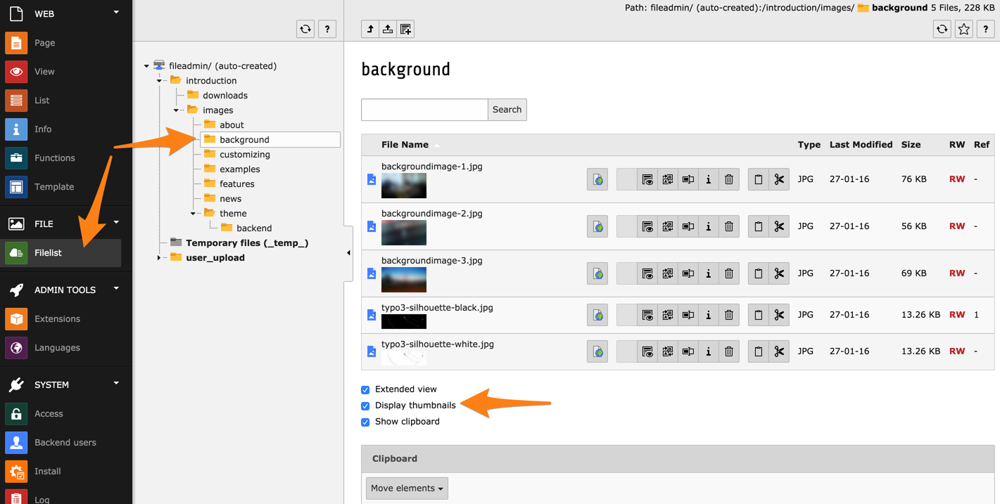

.. include:: ../Includes.txt

.. _the-file-module:
.. _the-file-module-or-image-archives:

Le module Fichiers
------------------

Le module **Fichier> Fichiers** est l'endroit où vous pouvez gérer
tous les médias associés au site web TYPO3 CMS.

.. _managing-files:
.. _managing-files-in-typo:

Gestion des fichiers dans TYPO3 CMS
^^^^^^^^^^^^^^^^^^^^^^^^^^^^^^^^^^^

Ce module est très similaire au module **WEB > Liste**.
Il affiche une arborescence de navigation, correspondant
à la structure de fichier sur le serveur,
et une liste de tous les fichiers du répertoire sélectionné.
Vous pouvez choisir de toujours afficher les vignettes
(cela peut être lent si vous avez beaucoup de fichiers dans le répertoire choisi).

Pour les administrateurs, le dossier affiché par défaut est appelé
"fileadmin/ (auto-created)" et correspond au dossier :file:`fileadmin/`
situé dans le dossier racine de votre répertoire du serveur web.

L'utilisation de ces fichiers à l'intérieur des éléments de contenu
pour les afficher ou lier sur votre site web est couvert dans
le :ref:`Tutoriel Éditeurs <t3editors:images>`.

.. note::

   Il existe des extensions qui permettent de se connecter
   à des stockages distants (comme un serveur WebDAV ou un compte Amazon S3)
   et de travailler avec les fichiers comme si ils étaient sur le serveur TYPO3 CMS.

Il y a un presse-papier, tout comme dans le module *Liste*.

En utilisant les icônes d'action, les fichiers peuvent être renommés
ou remplacés (juste en survolant les icônes et vous obtiendrez un texte d'aide).

.. _uploading-files:

Envoyer de nouveaux fichiers
""""""""""""""""""""""""""""

Vous pouvez télécharger des fichiers dans un dossier donné
en utilisant le menu contextuel ou dans le répertoire courant
en utilisant l'icône d'action dans le bandeau d'entête.

Vous obtiendrez la simple vue de téléchargement :

