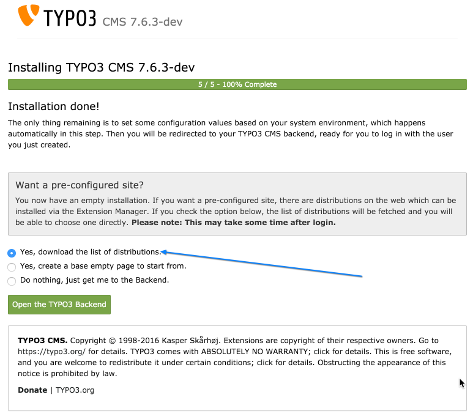
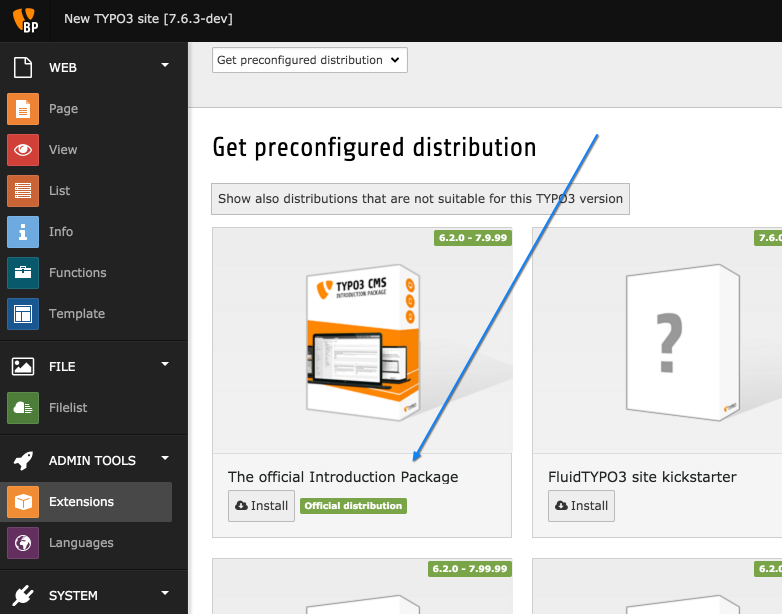

.. include:: ../Includes.txt

.. _installation:

Installation
------------

.. _prerequisite:

Pré-requis
^^^^^^^^^^

Pour essayer le CMS TYPO3 vous avez besoin d'avoir un serveur Web entièrement configuré et prêt
à l'emploi qui répond aux `exigences système minimales
<http://typo3.org/typo3-cms/overview/requirements/>`_.

Si vous ne disposez pas d'un serveur web et que vous exécutez un MS Windows
sur votre ordinateur, vous pourriez vouloir essayer le `TYPO3Winstaller
<http://typo3winstaller.sourceforge.net/>`_, qui installera un serveur web
et le CMS TYPO3 sur votre ordinateur.

Assurez-vous d'avoir les informations d'identification à votre base de données.

.. _getting-the-introduction-package:
.. _installing-typo3-cms-base-system:

Installation du système de base TYPO3 CMS
^^^^^^^^^^^^^^^^^^^^^^^^^^^^^^^^^^^^^^^^^

Vous devrez d'abord télécharger et installer le paquet TYPO3.
Suivez les étapes indiquées dans la partie :ref:`Installation rapide <t3install:quick-installation>`
du :ref:`Guide d'Installation et de mise à jour<t3install:start>`.

A l'étape 6, choisir de télécharger la liste des distributions.
Voir ci-dessous.

.. _installing-the-introduction-package:

Installation du paquet d'introduction
^^^^^^^^^^^^^^^^^^^^^^^^^^^^^^^^^^^^^

Lorsque vous êtes à l'étape 6 de l' outil d'installation,
choisissez de télécharger la liste des distributions .

Vous serez alors invité à vous connecter au backend TYPO3 CMS à l'aide
du login et du mot de passe que vous aurez défini juste avant à l'étape 5.
Vous serez automatiquement dirigés à la page vous permettant de choisir
une distribution.

Il suffit de cliquer sur le bouton "Installer" et un site web completement
préconfiguré sera installé en quelques minutes.
Il contient plusieurs pages et beaucoup d'exemple contenu.

Nous allons explorer tout ceci dans le reste de ce tutoriel .