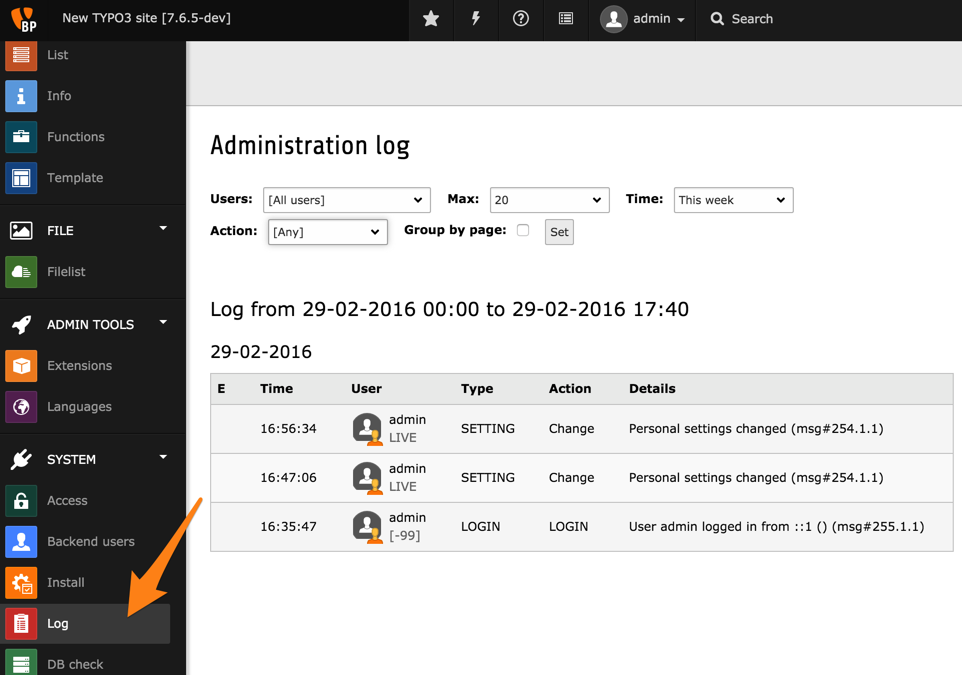
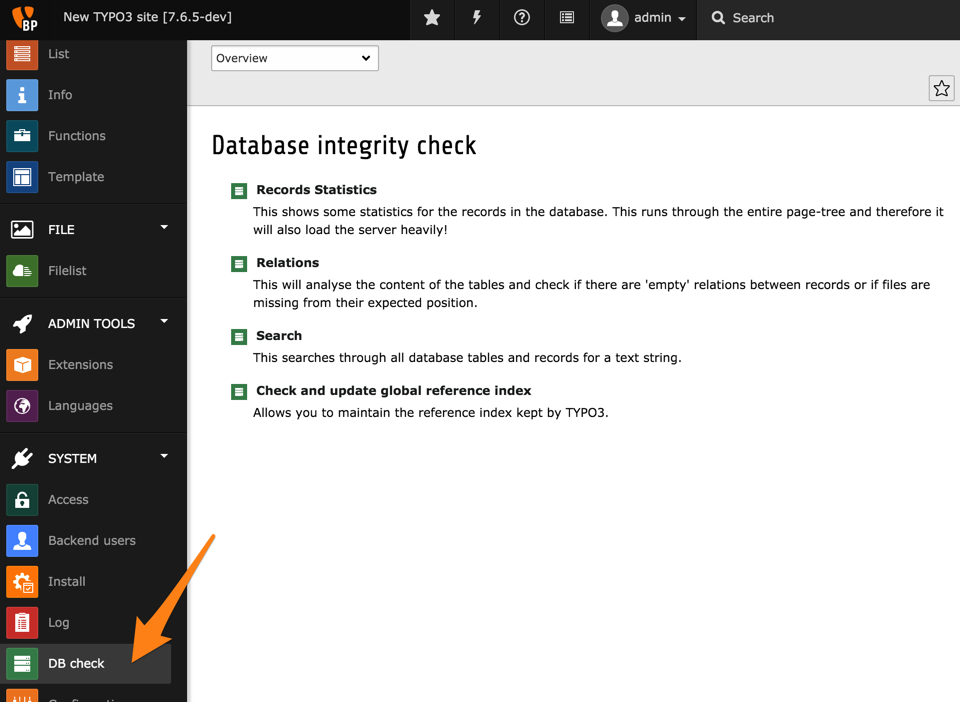
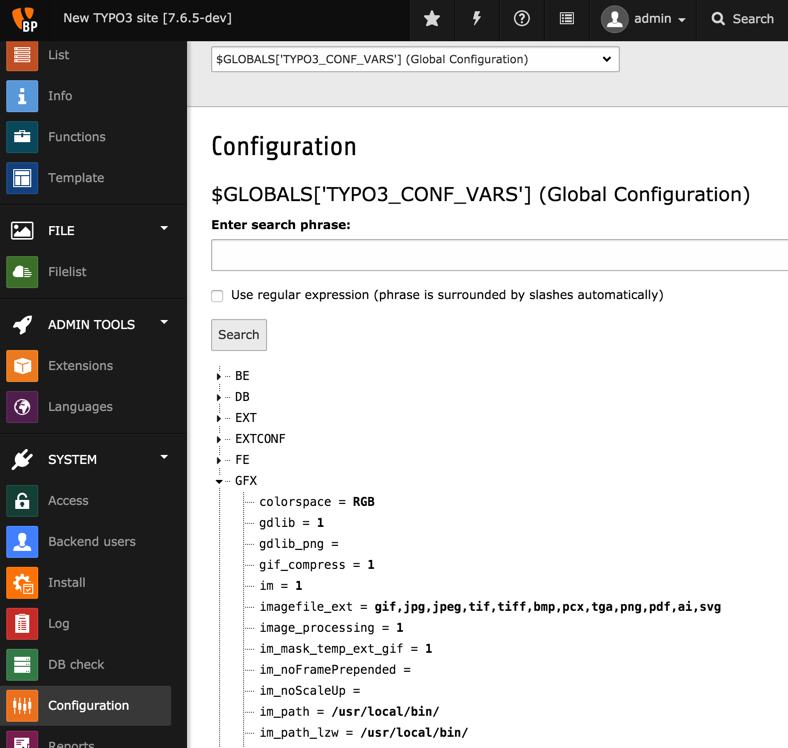
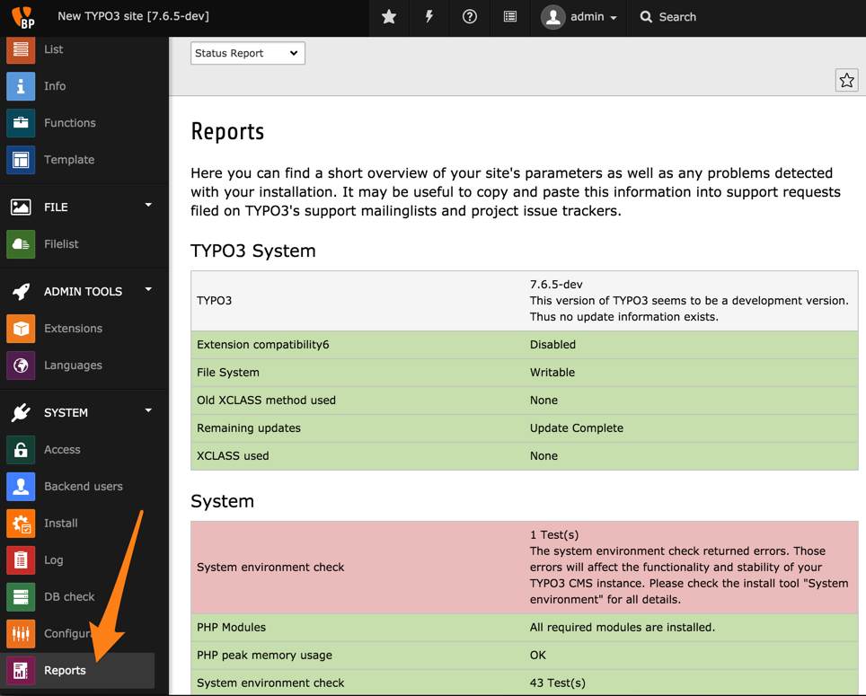

.. include:: ../../Includes.txt

.. _system-modules:

Les modules du système
^^^^^^^^^^^^^^^^^^^^^^

Dans le chapitre :ref:`Gestion des utilisateurs <user-management>`
nous avons déjà visité les modules *Accèss* et *Utilisateurs Backend*.
Voici une brève présentation des autres modules.

.. _system-modules-install:

Installation
""""""""""""

L'outil d'installation est présentée dans le :ref:`Guide d'installation <t3install:the-install-tool>`.
On peut y accéder directement à partir du backend CMS TYPO3.

The Install Tool is presented in the :ref:`Installation Guide <t3install:the-install-tool>`.
It can be accessed directly from the TYPO3 CMS backend.

.. _system-modules-log:

Fichier journal
"""""""""""""""

Le backend TYPO3 CMS trace un certain nombre d'actions effectuées
par les utilisateurs : connexion, suppression de cache,
les actions de base de données (création, mise à jour, suppression),
les changements de paramètres, les actions sur les fichiers et les erreurs.
Un certain nombre de filtres sont disponibles pour aider à exploiter ces données.

.. _system-modules-dbcheck:

Vérification BD
"""""""""""""""

Le module *Vérification base de données (BD)* offre quatre fonctions
liées à la base de données et son contenu.

Statistiques sur les enregistrements
  Montre quelques statistiques sur les enregistrements de la base de données. Cette opération parcourt toute l'arborescence des pages et par conséquent augmente beaucoup la charge sur le serveur !

Relations
  Lance une analyse du contenu des tables et vérifie s'il existe des relations "vides" entre les enregistrements ou si des fichiers ne sont pas présents là où ils sont supposés se trouver.

Rechercher
  Cherche un contenu texte dans toutes les tables et tous les enregistrements.
  Il propose un mode avancé qui est presque un constructeur visuel de requêtes.

Vérifier et mettre à jour l'index global des références
  Vous permet de maintenir l'index des références de TYPO3.
  TYPO3 CMS tient un registre des relations entre tous les enregistrements.
  Cela peut se désynchroniser lorsque certaines opérations sont effectuées
  hors du contexte strict du backend.
  Il est donc utile de mettre à jour cet index régulièrement.

.. _system-modules-configuration:

Configuration
"""""""""""""

Le module *Configuration* peut être utilisé pour visualiser
les différents tableaux de configuration utilisés par TYPO3 CMS.
Ce tutoriel n'a pas pour objectif de décrire le rôle de chacun de ces tableaux,
vous découvrirez leur fonction que vous progresserez plus profondément dans TYPO3 CMS.
Mentionnons simplement que `$GLOBALS['TYPO3_CONF_VARS']` contient
des valeurs de configuration globale que vous avez définis dans l'outil d'installation.

.. _system-modules-reports:

Rapports
""""""""

Le module *Rapports* contient des informations et des données de diagnostic
au sujet de votre installation TYPO3 CMS. Il est particulièrement intéressant
de vérifier régulièrement le « Rapport », car il vous informe de la mauvaise
configuration, les questions de sécurité, etc.

