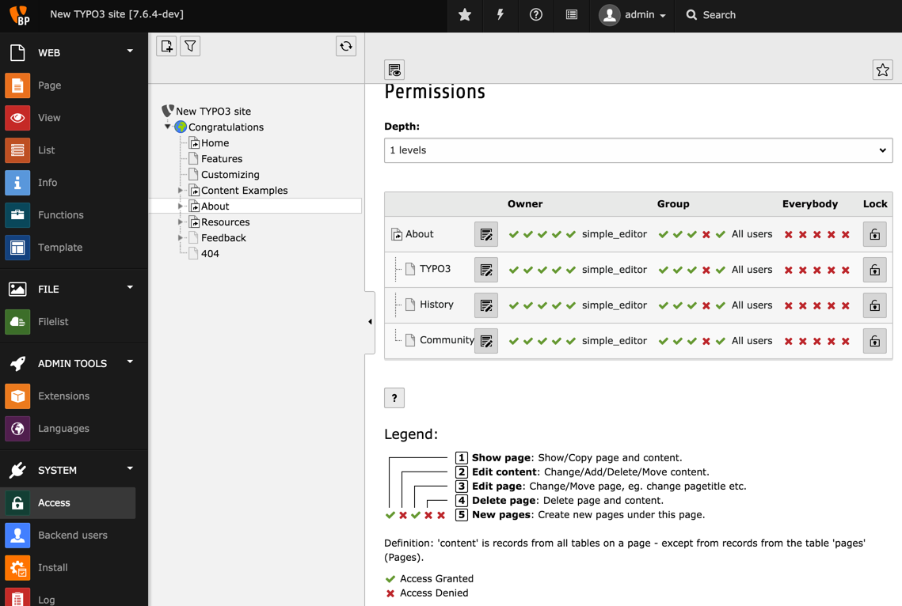
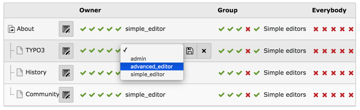
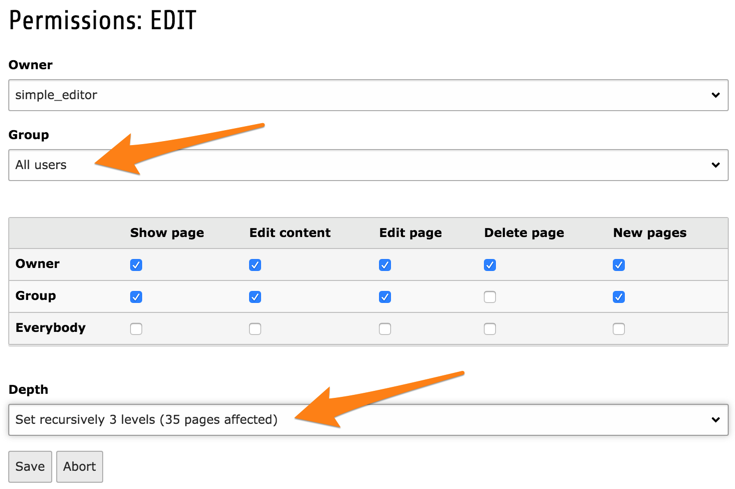
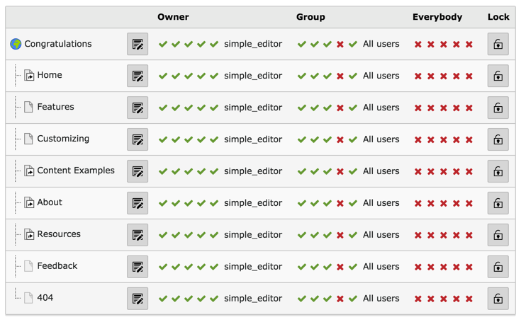

.. include:: ../../Includes.txt

.. _page-permissions:

Autorisations de pages
^^^^^^^^^^^^^^^^^^^^^^

:ref:`Les montages de base de données<db-mounts>` ne font pas tout dans l'accès aux pages.
Les utilisateurs et les groupes ont aussi besoin d'avoir des droits
pour effectuer des opérations sur les pages comme la visualisation, l'édition ou la suppression.

Ceci est géré en utilisant le module **SYSTEM > Accès** :

Chaque page a un propriétaire, qui est un utilisateur,
et a aussi une appartenance à un groupe.
Les droits peuvent être attribués au propriétaire,
au groupe ou à tout le monde.
Ce sera familier aux utilisateurs d'Unix.

Pour modifier une permission, cliquez simplement sur l'icône liée
et elle changer d'état. Pour changer le propriétaire ou le groupe d'une page donnée,
cliquez sur le nom du groupe ou du propriétaire et un petit formulaire s'affichera.

Il est également possible de changer le propriétaire,
le groupe et les autorisations de façon récursive,
même pour l'ensemble de l'arborescence de la page.
Placons nous sur la page d'accueil en cliquant sur
la page "Félicitations" dans l'arborescence de page.
Maintenant, cliquez à nouveau sur la page "Félicitations"
dans le module *Accès*. Vous devriez voir ce qui suit:

En choisissant «Tous les utilisateurs» comme groupe,
puis "Définir récursivement 3 niveaux" dans la liste déroulante "profondeur",
nous assignons toutes les pages de l'arborescence au groupe "Tous les utilisateurs".

En fait, ce changement fait sens, puisque le groupe "Tous les utilisateurs"
est un sous-groupe de deux groupes «éditeurs simples» et «éditeurs avancés».
De cette façon, les deux groupes auront les mêmes autorisations sur l'arborescence des pages.
Toutefois, étant donné qu'ils ont des montages de base de données différents,
ils n'auront pas accès au même ensemble de pages.

