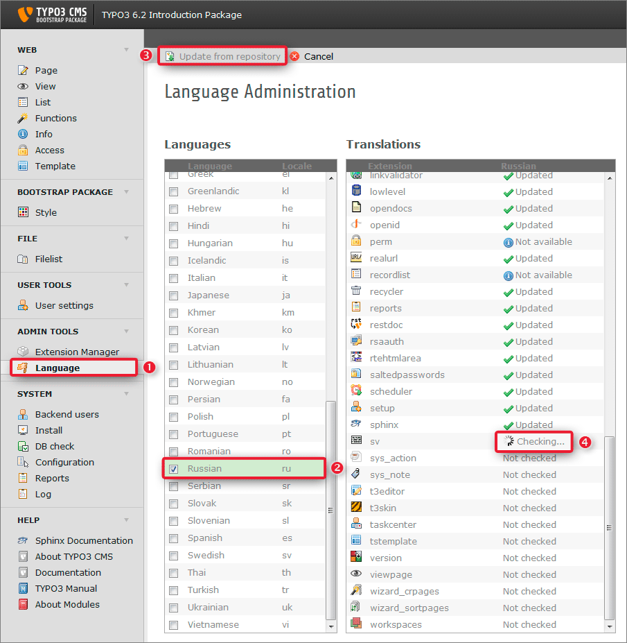
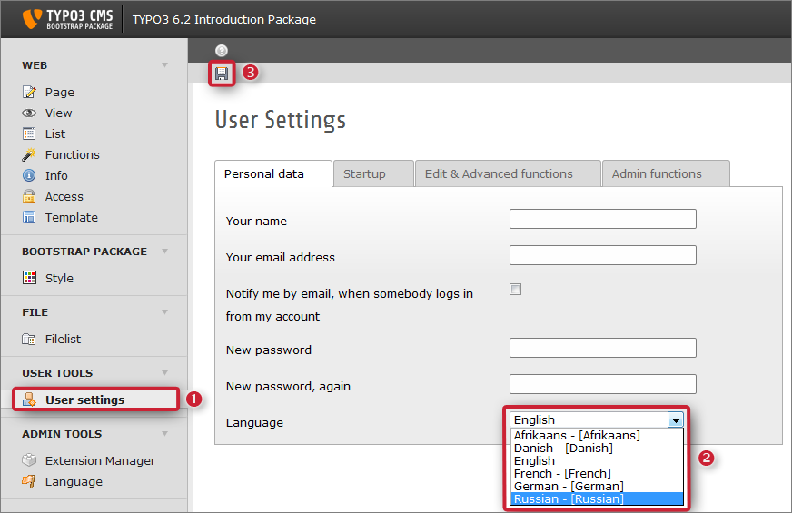
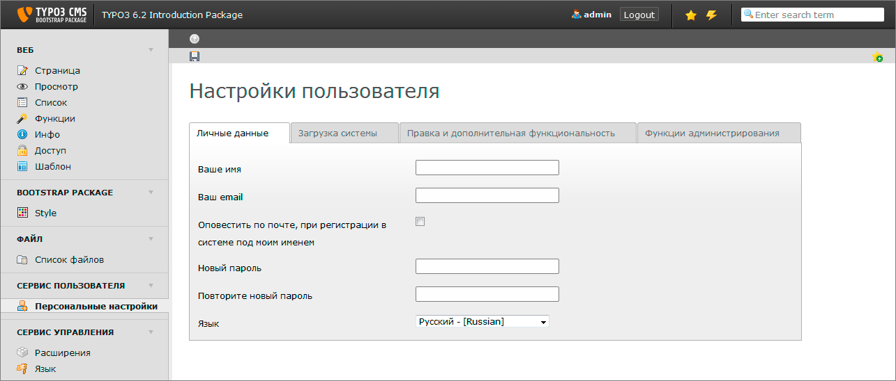

.. ==================================================
.. FOR YOUR INFORMATION
.. --------------------------------------------------
.. -*- coding: utf- -*- with BOM.

.. include:: ../../Includes.txt

.. _changing-backend-language:

Changing backend language
^^^^^^^^^^^^^^^^^^^^^^^^^

Usually an editor would like to use TYPO3 CMS in his own language. So you
need to change the backend language of TYPO3 CMS for him. As first step
download the language package you need. To do so select the *Language* (1)
module from the *ADMIN TOOLS*.

Select all language packages you want to provide to your users (2). Then click
on *Update from repository* (3). Updating the translations for all modules may
take a while. The progress is displayed by a rotating wheel (4). May be
translations are not available for every package. Also it may happen that not
all packages get downloaded. Just click on *Update from repository* (3) again
- the missing packages should be retrieved then.

So far you just downloaded the language packages. Now you need to alter your
*User settings* and select your language:

To do so select the *User settings* (1) module from the *USER TOOLS* and
select the language of your choice. Don not forget to save your new
configuration (3). A green colored box will inform you about the update of your
settings.

Now have a look at the main modules. As you see the module names now appear in
the language you selected before. When you click on *User settings* again even
this page will appear translated.

So far you just changed your own backend language. All editors needs to do it
for themselves.

When you create a new backend user you can give him a helping hand by selecting
a *Default Language* while creating the related backend user record. This
language will be used when the new backend user logs into TYPO3 CMS the first time.

.. figure:: ../../Images/T3CMS62-BE-CreateNewUser.png
   :alt:    TYPO3 CMS 6.2 default language for new backend user

.. caution::

    **Default Language versus User settings**

    Keep in mind the *Default Language* is nothing else than a default setting,
    really! If a new user has already logged in he has to switch to his preferred
    language by himself via the *User settings* module from the *USER TOOLS* as
    described above.
