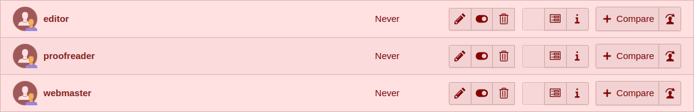
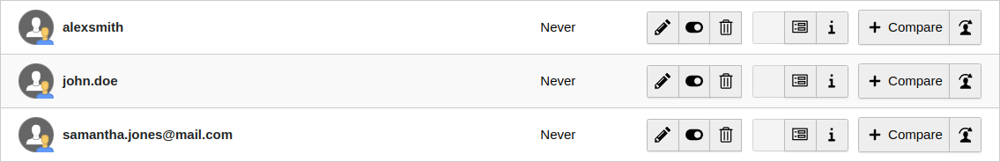
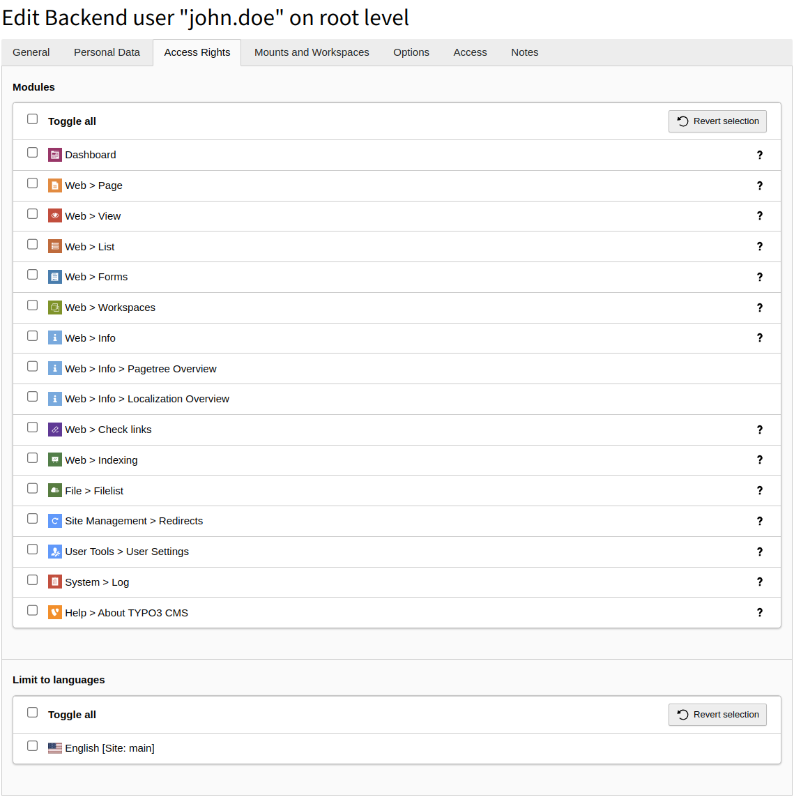

.. include:: /Includes.rst.txt

.. index:: backend, acl, permissions, user groups, user management

.. _general-recommendations:

=======================
General Recommendations
=======================

This recommendation, while not directly about setting permissions in TYPO3,
is closely related. As you progress through the next few chapters,
you'll find our advice to create top-level backend groups representing various roles,
such as editor, proofreader, etc. By establishing such Role groups,
we can then assign them to backend users.

.. _user-specific-accounts:

Create user-specific accounts
=============================

These users should not have generic usernames set like editor, webmaster, proofreader, etc.
Instead, you should use their real names, such as :samp:`johndoe`, :samp:`john.doe`, or even
their email address, :samp:`john.doe@mail.com`. This approach ensures you always know
which user logged into the TYPO3 backend and who is responsible for specific
changes in content or configuration. With top-level groups assigned, identifying
their roles becomes straightforward. It is also recommended in context of GDPR
to have properly named accounts to distinguish people.

   Bad username setup

   Good username setup

.. note::
    Avoid generic names for a backend username, instead use their real names.

.. _ensure-safety:

How to ensure safety
====================

When setting up permissions in TYPO3, it's really important to start off
by giving users just the access they actually need, and only add more
if it turns out they need it. This helps keep things safe. It's also a good idea
not to hand out admin rights unless there's no other option. For everyday tasks
like managing content, it's better to use special accounts set up just for those jobs.

If someone's only supposed to have access to the TYPO3 backend for a little while,
like a temporary worker or a student, it's a good idea to use TYPO3's feature
that lets you set a date when their account automatically stops working.
This way, you don't end up with old, unused accounts lying around, which can be
a security risk. Every so often, it's good to check and see which accounts
are still needed and which can be removed.

Each user account should be protected with a strong password to minimize the risk
of a security breach. Always adhere to :ref:`secure password selection guidelines <t3coreapi:security-secure-passwords>`
when creating a password for a new user or updating a password for an existing user.
By setting a strong example and informing users about your security policies,
you reinforce the importance of cybersecurity. It is also strongly advised
to set up Multi-factor authentication (MFA) which will provide an additional
layer of security.

.. note::
    - Grant users only the access they truly need
    - Instead of using administrative accounts, create groups for specific roles, such as editor, and assign these roles to users
    - Regularly maintain backend user accounts, removing any that are no longer needed
    - Always establish secure passwords for users

.. _permissions-via-groups:

Set permissions via groups, not user records
============================================

Some permissions or access rights can be directly configured through the backend
user record. This allows specifying which modules the user can see, the languages
they can use, and assigning database, file, or category mounts, as well as defining
allowed file and folder operations. While it may be tempting to set these permissions
directly through the user record, especially in small projects with only one or two
accounts managing content and configuration, this approach can become problematic
over time. It may be difficult to determine the origin of some permissions
if they are distributed across backend users and groups. Managing all permissions
exclusively through backend groups simplifies maintenance significantly.

   Avoid setting permissions directly through the backend user record

Consider a scenario where several backend users have specific permissions set,
alongside multiple groups that extend these permissions. If you need to update
access rights by adding or removing them, and these rights are configured at both
the user and group levels, you would have to individually edit each user account
to ensure the permissions are correctly granted or revoked. However,
if permissions were set exclusively for selected groups, you would only need
to update these groups, and all users within them would automatically inherit
the changes.

.. note::
    Configure permissions only through the backend user groups. Don’t set them on the user record.

.. _file-mounts-and-files-management:

File mounts and files management
================================

In the previous section, we described naming conventions for backend groups,
and File Mounts were already mentioned there. Now, let's discuss how many
File Mounts you should have.

When planning for permissions and file access, consider how many separate
entry points (File Mounts) within file storage you will need. At a minimum,
you should create separate folders for each site you manage and then configure
them as distinct File Mounts, which equate to separate backend groups.
These groups can later be assigned to users, granting them access to such folders.

There are cases where you might want some folders and the files within them
to be shared across multiple sites. For this purpose, you should create separate
File Mounts and dedicated groups for them. Then, you can combine these groups
within a role group, ensuring that each user associated with such a role group
will have access to the specified folders and files in the storage.
Let's look at an example.

..  uml:: _sample_backend_groups_hierarchy.plantuml
    :align: center
    :caption: Sample backend groups hierarchy
    :width: 700

This is a simple diagram illustrating how you can structure your folders in storage,
create dedicated File Mounts for them, and then use those File Mounts within backend user groups.
This setup allows two users with editor roles, where the first one can access
files from Website A and Shared folders, and the second one from Website B and Shared folders.

Of course, sometimes you'll need a more complex configuration, with a more
nested folder structure for each site. However, the setup remains similar -
you create separate File Mounts where needed and a backend group that will
utilize this File Mount. Then, you assign such groups to role groups.

.. note::
    For each File Mount create a separate backend user group.
