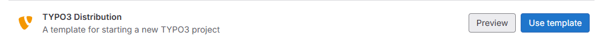
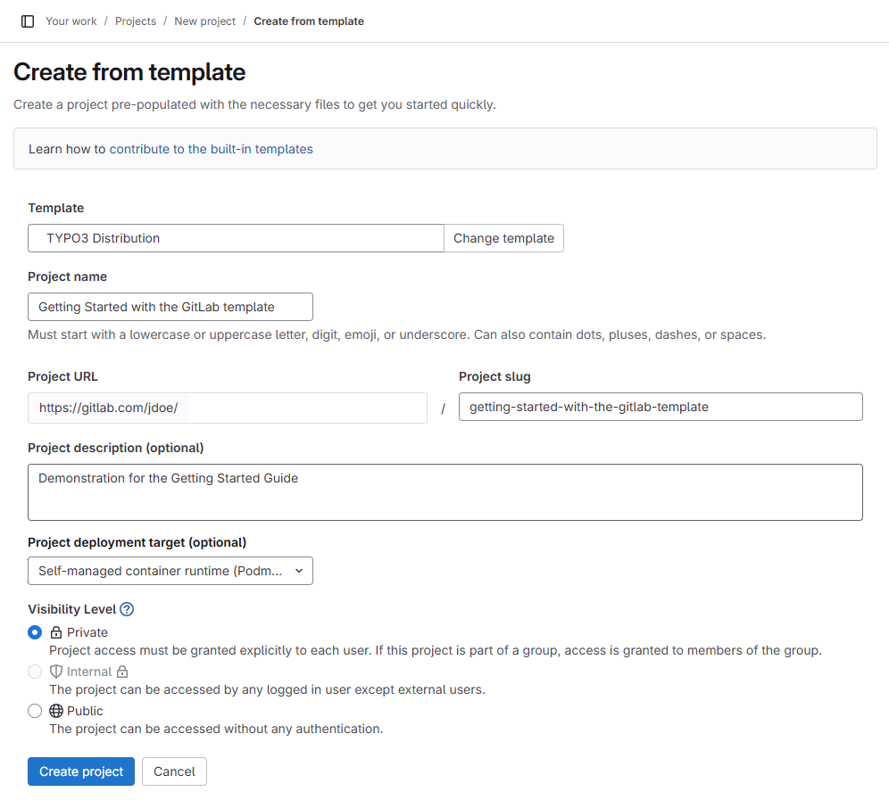
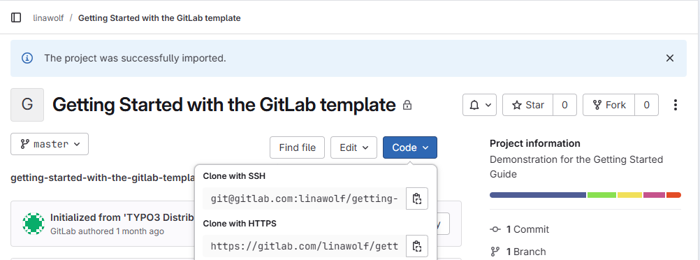
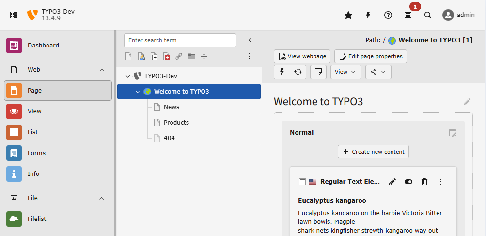

:navigation-title: GitLab template

..  include:: /Includes.rst.txt
..  _gitlab-template:

==========================================================
Creating a TYPO3 project from the official GitLab template
==========================================================

..  admonition:: Prerequisites

    *   Knowledge about Git
    *   A GitLab account or self-hosted GitLab
    *   Planning to do deployment
    *   DDEV and Git installed locally

..  _gitlab-template-create:

Create from template
====================

Go to page `GitLab - New from template <https://gitlab.com/projects/new#create_from_template>`_
or to path `/new#create_from_template` on your self-hosted GitLab. And chose
:guilabel:`TYPO3 Distribution` from the list:

    Click on "Use template"

..  _gitlab-template-create-details:

Fill in project details
=======================

    Fill in the details

..  _gitlab-template-clone:

Clone the project
=================

Clone the project to your local machine. You can download the SSH link from
the :guilabel:`Code` dropdown:

    Copy the "Clone with SSH" link

Then clone the repository:

..  code-block:: bash

    git clone git@gitlab.com:linawolf/getting-started-with-the-gitlab-template.git

..  note::
    You need an `SSH key (GitLab docu) <https://docs.gitlab.com/user/ssh/>`_ to
    do this.

..  _gitlab-template-setup:

Start DDEV and setup TYPO3
==========================

You can start and setup the project locally in DDEV using the built-in command:

..  code-block:: bash

    ddev typo3-init

See also file :file:`Readme.md` in the root of your project.

This step automatically creates several files that should be added to git:

..  code-block:: bash

    $ git status
    On branch main
    Your branch is up to date with 'origin/main'.

    Untracked files:
      (use "git add <file>..." to include in what will be committed)
            composer.lock
            config/sites/
            package-lock.json

    nothing added to commit but untracked files present (use "git add" to track)

    $ git add .

:file:`composer.lock`
    This file contains the information which exact versions of PHP packages
    are installed.
:file:`package-lock.json`
    This file contains the information which exact versions of npm packages
    are installed.
:file:`config/sites/`
    Contains configuration and settings of the site that was created during
    setup.

..  _gitlab-template-login:

Log into the TYPO3 backend
==========================

If allowed by your system the TYPO3 backend login will be automatically opened
in a browser. Otherwise you can open a browser of your choice with the
link displayed in the console.

A default user has been created. Username and password are displayed in your
console.

Once logged in, you can preview a page and see it rendered with a basic theme.

..  _gitlab-template-directory:

Directory structure of the project
==================================

..  directory-tree::

    *   :path:`.ddev` DDEV configuration
    *   :path:`assets` assets for a basic theme that will be built by vite
    *   :path:`config` system and site configuration created during setup
    *   :path:`node_modules` Managed by npm and vite
    *   :path:`packages`

        *   :path:`site-distribution` basic site package that you can adjust

    *   :path:`public` webroot of the server
    *   :path:`var` you can find the logs and other temporary files here
    *   :path:`vendor` all packages are installed here
    *   :file:`composer.json` constraints for
    *   :file:`composer.lock` contains the information which exact versions
        of PHP packages are installed.
    *   :file:`package.json` constraints for frontend libraries
    *   :file:`package-lock.json` contains the information which exact versions
        of npm packages are installed.
    *   :file:`vite.config.js` predefined vite configuration
