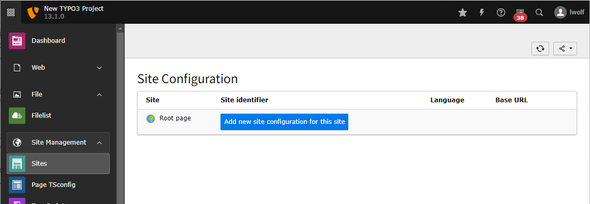
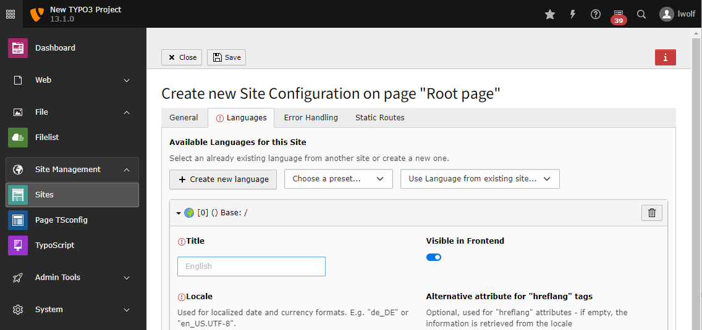

.. include:: /Includes.rst.txt

.. _site-management:

===============
Site Management
===============

.. _site-configuration:

Create a new site configuration
===============================

Before you create a site configuration you should have created the root page of
your site in the page tree.

The site configuration is stored in a file called
:file:`config/sites/my_site/config.yaml`. For your convenience you
can edit this file with the backend module
:guilabel:`Site Management > Sites`.

Available root pages should be listed in this module. Click on the
button :guilabel:`Add new site configuration` beside that page to create a
site configuration for it.

    Create a new site configuration

In the next step you can enter some basic information about the site.

The site identifier will can be arbitrary so we use "example_site" here.
The entry point should be an URL pointing to the web root. In our example this
is a URL generated by DDEV.

..  versionadded:: 13.1
    Site sets have been added with TYPO3

From the list of available sets choose the set of your site package if you have
one. You can learn to create a site package in the
:ref:`TYPO3 Sitepackage Tutorial <t3sitepackage:start>`.

..  figure:: NewSitePage1.png

    Enter the basic data and choose the site set

As our set already depends on the set of fluid_styled_content it is not
necessary to chose that set here.

    Create a language for your site by choosing it from the list of presets

In the next two tabs you can define error handling like a custom 404 and static
routes, for example to a :file:`robots.txt`. We do not cover these topics here.

Here you can read about :ref:`Site handling <t3coreapi:sitehandling>` in general.

After saving a new file should have been created in your project:

..  literalinclude:: _config.yaml
    :language: yaml
    :caption: config/sites/example_site/config.yaml
