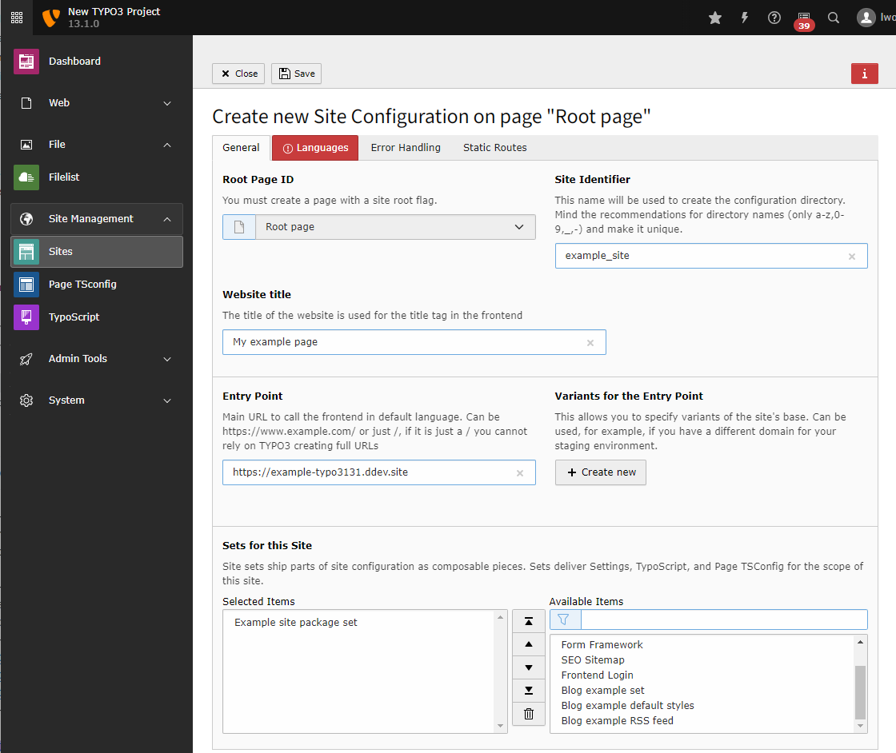

..  include:: /Includes.rst.txt

..  _site-management:

===============
Site Management
===============

..  _site-configuration:

Create a new site configuration
===============================

Before creating a site configuration, you should have created the root page of
your site in the page tree.

..  todo: Link to "How to create a root page", once https://github.com/TYPO3-Documentation/TYPO3CMS-Tutorial-GettingStarted/issues/421
    is resolved.

The site configuration is stored in a file called
:file:`config/sites/my_site/config.yaml`. For your convenience, you can
edit this file using the backend module: :guilabel:`Site Management > Sites`.

Available root pages should be listed in this module. Click
the button :guilabel:`Add new site configuration` next to the relevant
page to create a site configuration for it.

    Create a new site configuration

In the next step, you can enter some basic information about the site.

The site identifier can be arbitrary, so we use "example_site" here. The
entry point should be a URL pointing to the web root. In this example, it is
a local URL generated by `DDEV <https://ddev.com/>`__.

..  versionadded:: 13.1
    Site sets have been added with TYPO3

From the list of available sets, choose the set for your site package if you
have one. You can learn how to create a site package in the
:ref:`TYPO3 Sitepackage Tutorial <t3sitepackage:start>`.

    Enter the basic data and choose the site set

Since our set already depends on the set of fluid_styled_content, it is
not necessary to choose that set here.

..  figure:: NewSitePageLanguage.png
    :alt: Screenshot of the tab "Languages" of a newly created site configuration

    Create a language for your site by selecting it from the list of presets

In the next two tabs, you can define error handling, such as a custom 404 page,
and static routes, for example, to a :file:`robots.txt` file.

You can read more about :ref:`Site Handling <t3coreapi:sitehandling>` in
the reference "TYPO3 Explained".

After saving, a new file should be created in your project:

.. literalinclude:: _config.yaml
   :language: yaml
   :caption: config/sites/example_site/config.yaml
