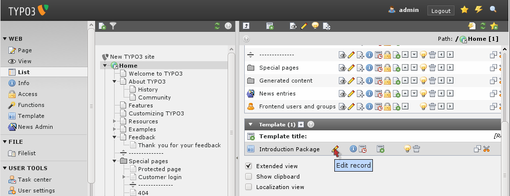

.. ==================================================
.. FOR YOUR INFORMATION
.. --------------------------------------------------
.. -*- coding: utf-8 -*- with BOM.

.. include:: ../../Includes.txt

((generated))
^^^^^^^^^^^^^

.. _static-and-dynamic-content:

Static and dynamic content
""""""""""""""""""""""""""

Consider the "Introduction Package" website:

.. figure:: ../../Images/manual_html_m390acc1e.png
   :alt:

**Dynamic parts:** On this website the menu (#1), (#2) and the
breadcrumb navigation (#3) are indirectly dynamic parts of the page.
This means they change from page to page automatically. We cannot
directly affect these items per page. They are dynamically programmed
parts of the template.However the content area (#4), (#5) is a
directly dynamic part of the page since this is where the page
specific content is inserted. We can affect this by adding, removing
and rearranging page content elements! This area is not at all a part
of the template (excepts its formatting in colors and fonts) since we
directly control it by the content elements.

**Static parts:** Apart from the dynamic parts the template consists
always of the same sitetitle (#6), the same background image (#7), a
link to the frontend login (#8) and the search field (#9). These parts
are also a part of the template (like the indirectly dynamic parts)
but they never change by any action. Always the same on each page.

.. _template-records:

Template Records?
"""""""""""""""""

So how does TYPO3 implement this principle? Well, you can read in-
depth information about the `*recommended approach for
professionally made website in the tutorial Modern Template Building*
<http://docs.typo3.org/typo3cms/extensions/doc_tut_templselect/>`_ .
However this is written for people who are professionally working with
web design in teams with developers, designers etc. So the level is a
bit higher than this tutorial claims to be.

But the main point is - the template record. This is a control element
that instructs TYPO3 how to handle a certain branch of the page tree.
If this seems like an awkward approach to you at first then so be it -
it is in fact highly consistent with what you have learned already and
further it makes perfect sense when you later want to make many sites
in the same page tree including multiple templates etc.

If you look at the simple Introduction Package website in our case
notice that the root page of the website contains such a template
record:

If you edit the template "Introduction Package" you will see that most
fields are empty. For each website you need a TypoScript template on
the ROOT level, in this case that is the "Introduction Package"
template. The TypoScript configuration of a website can be quite long
therefore it is possible to make many small TypoScript templates that
get included in the main template. For better maintenance, all
TypoScript of the Introduction Package has been put into the folder
'Typoscript Templates'. The only thing the "Introduction Package"
template does is to include the "ROOT" template that in turn includes
other templates.