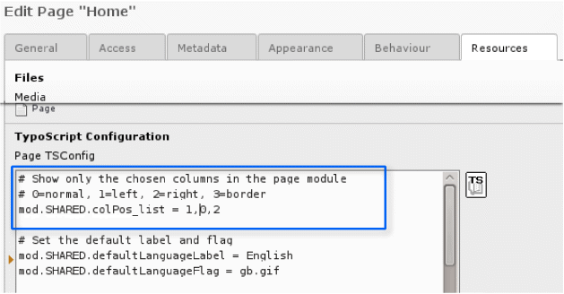
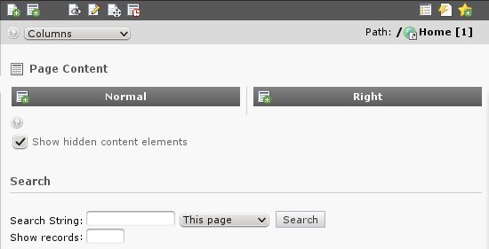
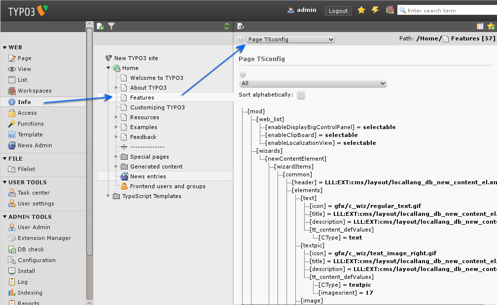

.. ==================================================
.. FOR YOUR INFORMATION
.. --------------------------------------------------
.. -*- coding: utf-8 -*- with BOM.

.. include:: ../../Includes.txt

.. _content-in-multiple-columns:

Content in multiple columns
^^^^^^^^^^^^^^^^^^^^^^^^^^^

As you have probably noticed your Introduction Package shows three
columns in the page module, left, normal and right. If you look
further you might additionally notice, that the left column is empty.
So if you want to configure your TYPO3 more comfortable and easier to
understand you'd want to hide that useless empty column. That is what
we will do now.

To configure how the TYPO3 backend looks so called TSconfig is used.
TSconfig (TypoScript Configuration) is stored on pages and will have
an effect on the page it is stored on and on all underlying pages. So
if we want to hide the left column everywhere in our website we should
change the TSconfig of our root page.

Click the page icon of our root page and choose "Edit page
properties", then choose the tab "Resources" and have a look at the
"TypoScript configuration" field:

As you could guess from the comment, you just have to delete the "1"
in the third line to disable the left column in the page view. Easy,
isn't it? This is what you should get after saving the page:

.. _verifying-page-tsconfig:

Verifying Page TSconfig
"""""""""""""""""""""""

Page TSconfig affects the page it is on and its underlying pages, if
you are unsure whether or not a TSconfig option has an effect on the
page you are on use the info module to show the current configuration.
Choose "Info" from the main modules, then the page you want to
inspect. After that choose Page TSconfig from the select box on the
info page:

Again you see an hierarchical tree, this time of the backend
configuration of TYPO3.