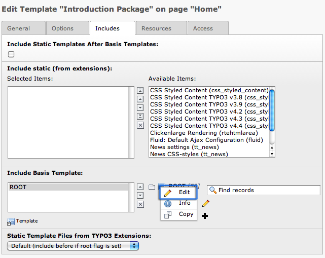
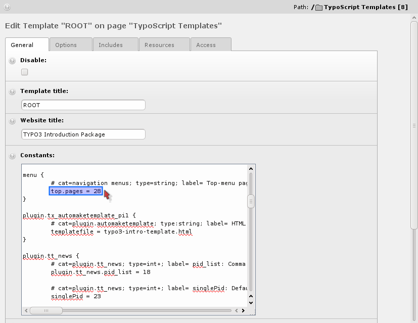
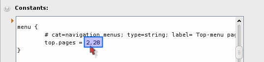
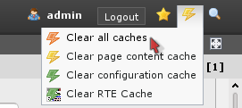
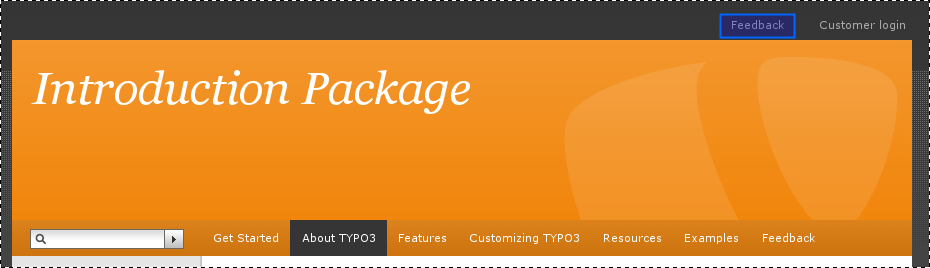
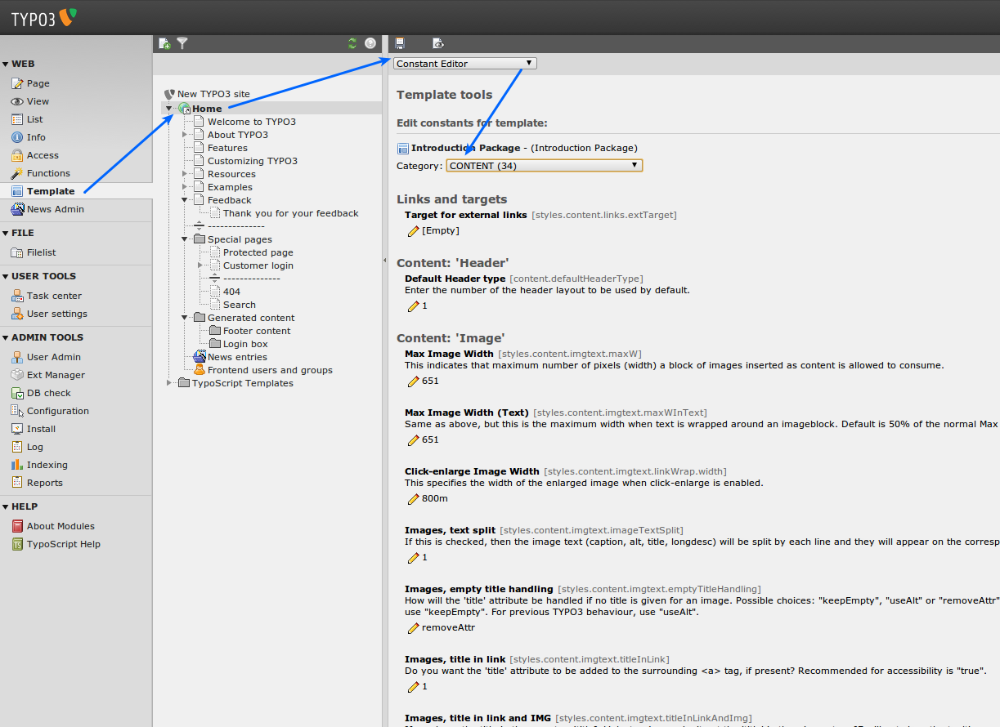

.. ==================================================
.. FOR YOUR INFORMATION
.. --------------------------------------------------
.. -*- coding: utf-8 -*- with BOM.

.. include:: ../../Includes.txt
.. include:: Images.txt

.. _making-changes-to-the-template:

Making changes to the template
^^^^^^^^^^^^^^^^^^^^^^^^^^^^^^

Let’s try to change a few things in the template record, "ROOT". Edit
the template "Introduction Package" and select the tab "Includes". In
section "Include basis template" click on the Icon before "ROOT" and
select edit.

Now you can edit the "ROOT" template in place:

For standard templates the "Constants" field is often the place to
change values. Constants define things that are used in many places in
templates, like the name of the default template or the page where
your news are coming from. Constants can then be used in the "Setup"
field. For example if you have a constant definition like
menu.top.pages = 28 you can later use it in the setup as
{$menu.top.pages} and it will be substituted automatically with the
value (28 in this case). So one change to a constant may mean many
changes in different places in the final TypoScript configuration code
of the template.

In our case, let's add the feedback page to the top right menu.

Just add the page "Feedback" (id 2) to the list of pages in the top
right menu.

After saving the template record, click "Clear all cache" in the
"Admin Functions" menu:

**Always do that** if you edit template records directly *.*

The result is:

You can play with other values as well!

.. _the-constant-editor:

The constant editor:
""""""""""""""""""""

The better way to handle these changes is to use the Template module
in the "Constant Editor" view:

With the constant editor you can edited most constants in a
comfortable way. They have additional descriptions telling you what
they do. Every constant is in a certain category. You can switch the
categories with the "Category" select box on top.

To repeat the change we did earlier (adding the Feedback page to the
top right menu) choose "Navigation Menus" from the category menu and
edit the constant:

.. figure:: ../../Images/manual_html_m30fea067.png
   :alt:

Now go and take a look around at what is available, play with the
options and come back when you've had enough.