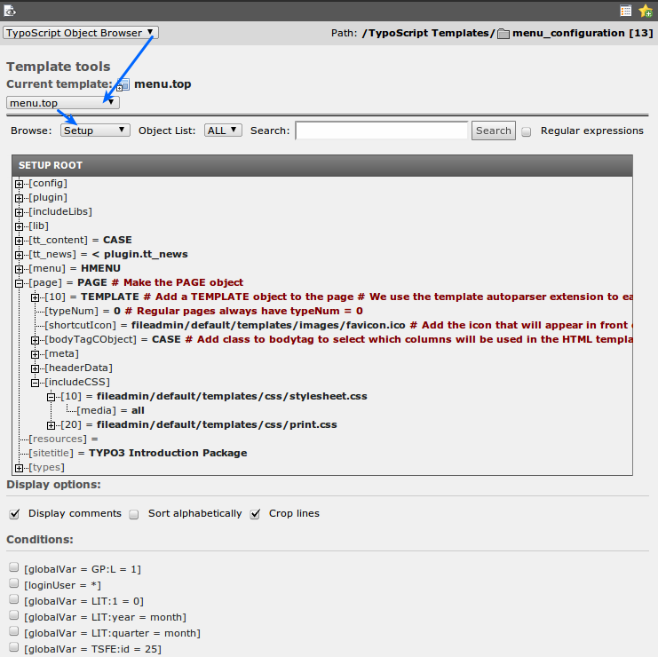

.. include:: ../../Includes.txt

.. _the-object-browser:

The Object Browser
^^^^^^^^^^^^^^^^^^

There is one other tool you should know when working with TypoScript.
It is called the "Object Browser". Change the select box on top of the
template module to "TypoScript Object Browser":

The object browser shows you the TypoScript configuration of your
website as an object tree, for example on the image above you can see
how the notation "page.includeCSS.10 = fileadmin..." is transformed
into a tree structure. You can click the properties in the template to
change them directly. Any changes are written to the current template
(Which template is the current template? Look at the header of the
Object Browser!)
