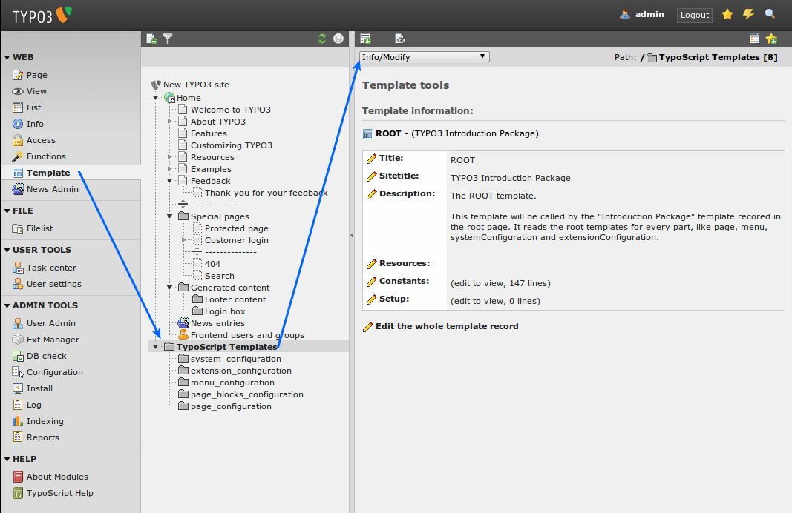
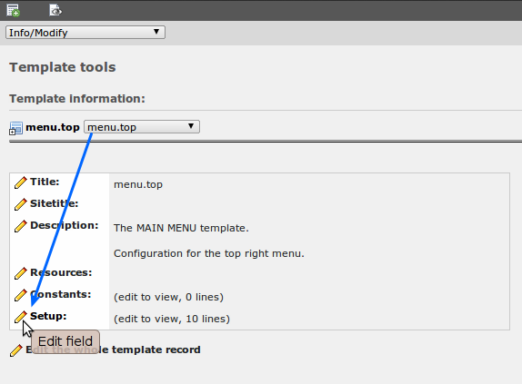
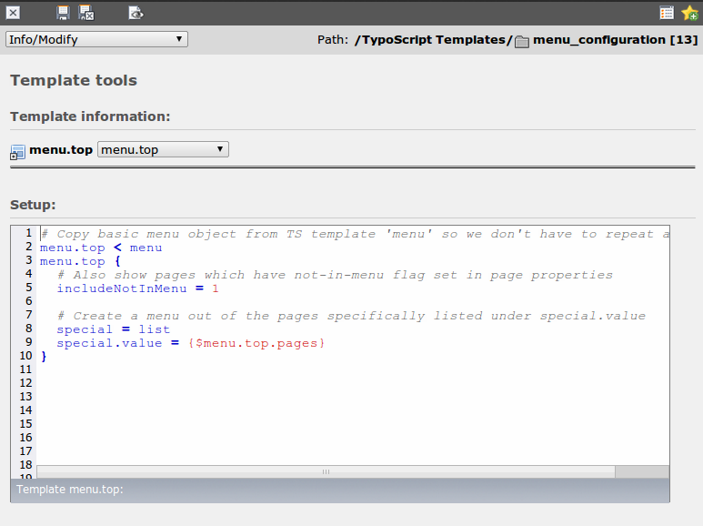

.. ==================================================
.. FOR YOUR INFORMATION
.. --------------------------------------------------
.. -*- coding: utf-8 -*- with BOM.

.. include:: ../../Includes.txt

.. _the-setup-field:

The Setup field
^^^^^^^^^^^^^^^

The constant field allows you to edit the defined constants fast and
change general things on your website. The next level is to change the
details or something more general like if there is a top right menu or
not. The easiest way to do that is to use the "Info/Modify" view which
allows you direct access to the important parts of the template.

As you can see the template has a description that explains shortly
what it does. All templates in the Introduction Package have this kind
of short explanation, so you can click through them all and get an
overview.

Click on the subfolder menu\_configuration now. You will see that not
one but multiple templates are stored in it.

.. figure:: ../../Images/manual_html_m6420792b.png
   :alt:

Choose the template "menu.top" now to see the definition of the top
right menu and click the pencil next to "Setup" (Notice how there is a
link below the menu block which directly points you to editing of the
full template record if you need it):

Don't worry if you don't understand what you see yet, this tutorial
just shows you the general principles and where you find what, the
next tutorials will show you in-depth what TypoScript is and how you
can use it to create your own websites.

One thing you can see in this template is the usage of the constant we
changed earlier {$menu.top.pages} in the template.