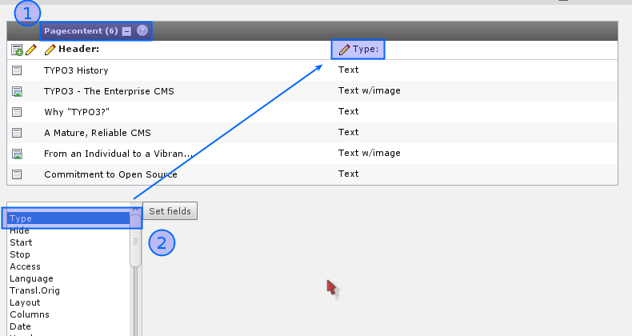
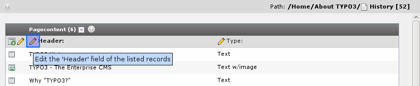
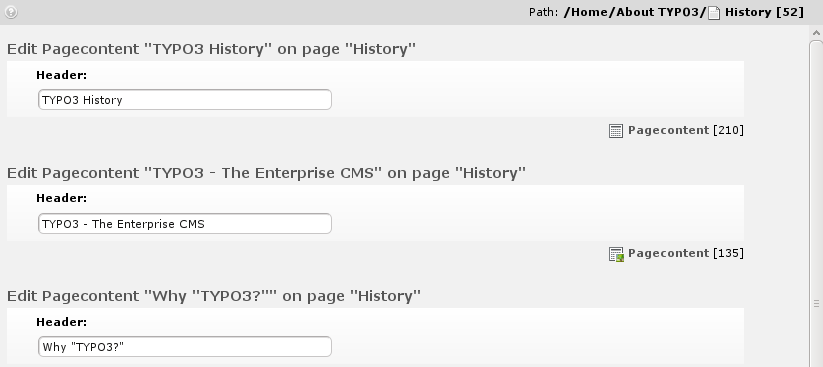
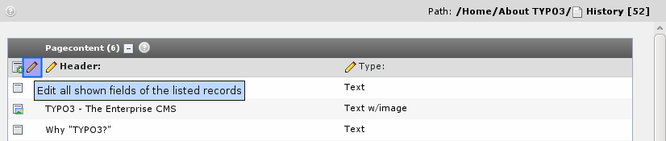
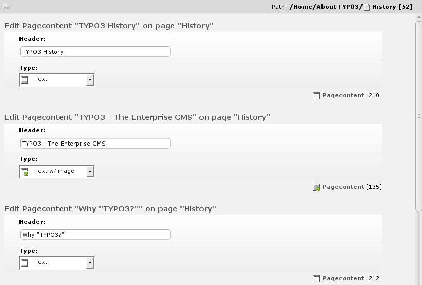
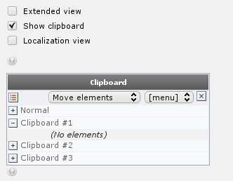
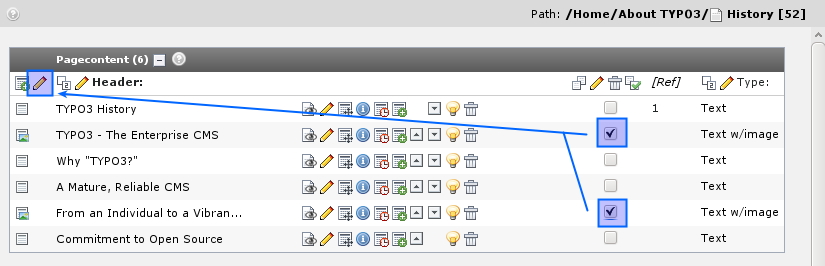

.. ==================================================
.. FOR YOUR INFORMATION
.. --------------------------------------------------
.. -*- coding: utf-8 -*- with BOM.

.. include:: ../../Includes.txt

.. _selective-editing:

Selective editing
^^^^^^^^^^^^^^^^^

The list module also uses the check boxes for elements for another
purpose - selective multi-editing. To enable this you must first of
all click the title of the table in the List module (#1):

This will enable the extended mode. Here you can select additional
fields from the table you want to view as well (#2). Select the "Type"
field for now. This will make the "Type" field appear in addition to
the "Header" field already there.

.. _editing-all-headers:

Editing all headers
"""""""""""""""""""

Simply click the little pencil next to the "Header" label:

You will see this next:

This feature allows you to edit the same field from a large number of
records in one stroke of the pen! Very comfortable!

You can do the same for both the Header and Type field at one time -
just use another edit-pencil:

The result will be almost the same form - but with an additional
field:

Now, activate the clipboard and select one of the numeric clipboards:

The really cool thing is if you tick off only  *some* of the listed
records:

Then you will - guessed it? - only get to edit those two!

.. figure:: ../../Images/manual_html_363cce74.png
   :alt:

Powerful stuff.

Now do the math yourself for the rest of the buttons! Play around with
them now that you have the chance with this test website.