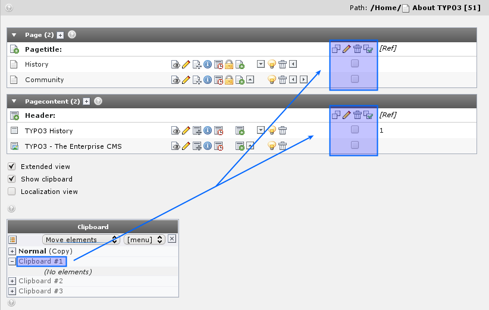
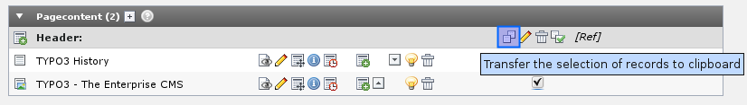
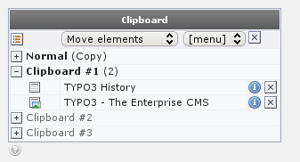
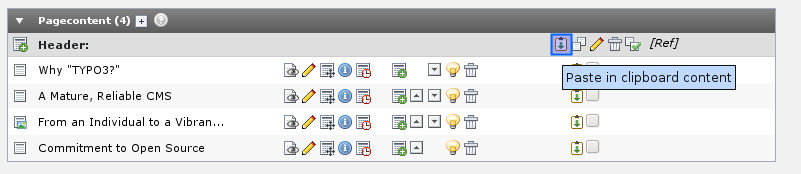
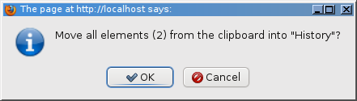
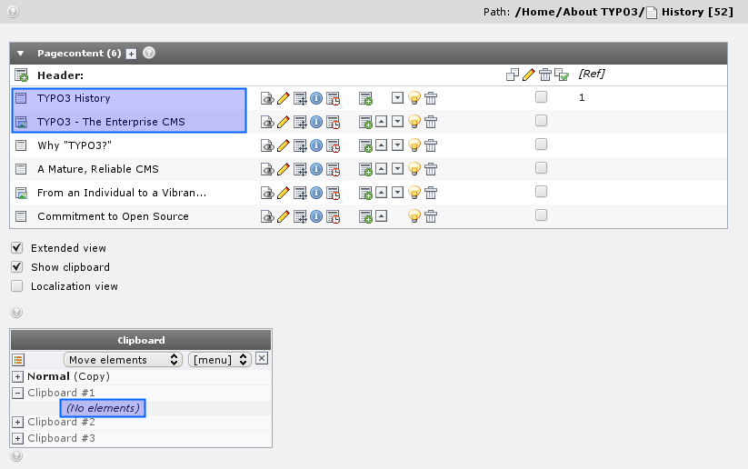
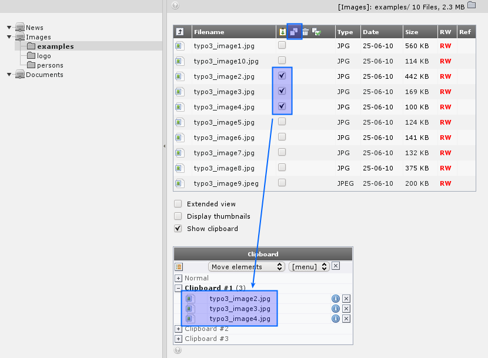

.. ==================================================
.. FOR YOUR INFORMATION
.. --------------------------------------------------
.. -*- coding: utf-8 -*- with BOM.

.. include:: ../../Includes.txt

.. _the-numeric-clipboard-pads-managing-many-elements:

The numeric clipboard pads - managing many elements
^^^^^^^^^^^^^^^^^^^^^^^^^^^^^^^^^^^^^^^^^^^^^^^^^^^

Back to the clipboard - select one of the "numeric pads" now:

Now you can tick off the elements to select for the clipboard - thus
you can have not just  *one* but  *multiple elements* selected at
once!

Select the first two elements and press the "Transfer..." button:

The elements are now registered for "move" on the clipboard:

Pasting them onto another page is not just a question about going to
that page and click the "Paste into" icon:

After confirming the warning...

... you will see the two elements moved to the top of the page and the
clipboard pane #1 emptied:

.. _managing-files:

Managing files
""""""""""""""

You can do the same thing for files in the Filelist module. Just a
quick view - and you can see the principles are the same:

