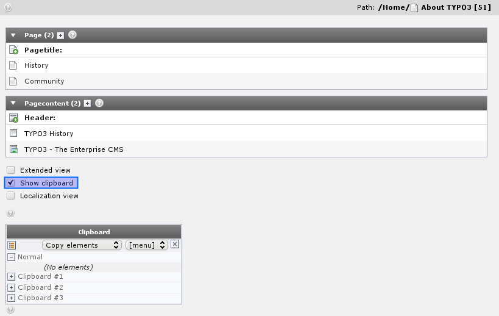
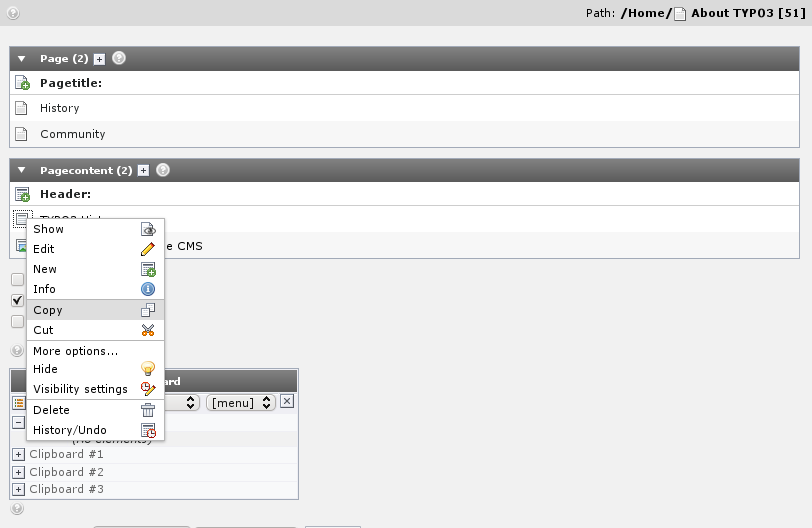
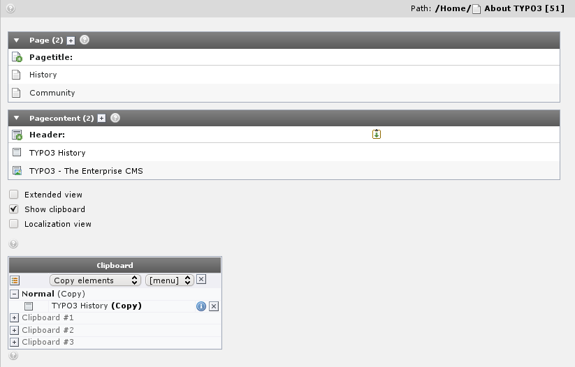
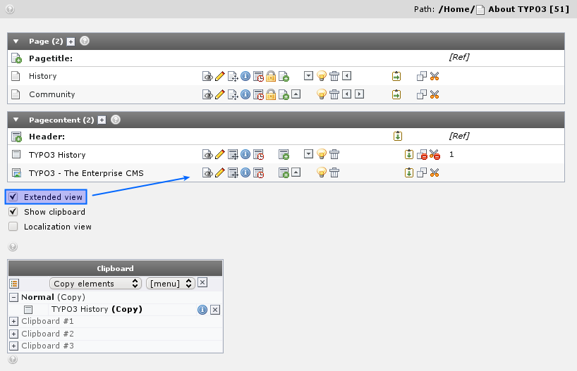

.. ==================================================
.. FOR YOUR INFORMATION
.. --------------------------------------------------
.. -*- coding: utf-8 -*- with BOM.

.. include:: ../../Includes.txt

.. _using-the-list-module-effectively:

Using the List module effectively
^^^^^^^^^^^^^^^^^^^^^^^^^^^^^^^^^

You might already have used the clipboard to move a content element
from one page to another. But let's see what happens behind the
scenes:

On the "About TYPO3" page we have two content elements. View the page
content with the List module, enable the "Clipboard" checkbox and
select "Copy" for an element.

Notice how this element gets registered in the clipboard that is shown
now! (You will have to refresh the List module before it is shown).

If you select another element the first one is removed. "Cutting"
element is the same - it is just being registered as "Cut" instead.

If you enable "Extended view" checkbox you can see a whole panel of
nifty little buttons which are all great shortcuts instead of
activating the context menu all the time:

Try to play around with the buttons here!