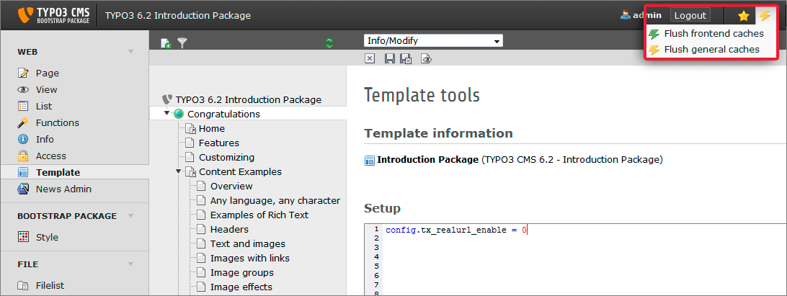

.. ==================================================
.. FOR YOUR INFORMATION
.. --------------------------------------------------
.. -*- coding: utf-8 -*- with BOM.

.. include:: ../../Includes.txt

.. _human-readable-url-s:

Human readable URLs
^^^^^^^^^^^^^^^^^^^

By default TYPO3 CMS identifies the page which should be delivered by the "?id"
parameter. Just enter  *http://www.your-site.example.org/index.php?id=33* to get
the "Overview" page of the Introduction Package.

As every page in TYPO3 has its own id, you only need to know this id to get the
page itself. But for your visitors the URL
*http://www.your-site.example.org/content-examples/overview.html* would look more beautiful.
In TYPO3 this features is realized by an extension (actually there are several).
The Introduction Package uses an extension called "RealURL" for this purpose.
If you have special needs regarding to the scheme of your URLs have a look at its
manual.

RealURL should work out of the box in the Introduction Package. If it does
work and you are redirected to the "Congratulations" respectively "GET STARTED"
page each time you click in the frontend you may deactivate the extension "RealURL".
To do so go to the template module by choosing WEB > Template, select the "Congratulations"
page in the page tree, select "Info/Modify" from the drop down on top of the
content area, click on "Setup" and copy the following line into the text box::

   config.tx_realurl_enable = 0

Save the template record and clear (flush) all caches:

All pages should be rendered with "?id=" instead of human readable URLs now.
Hence you should be able to navigate trough your website in the frontend.

