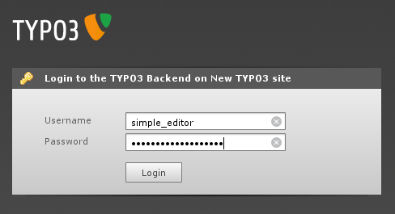
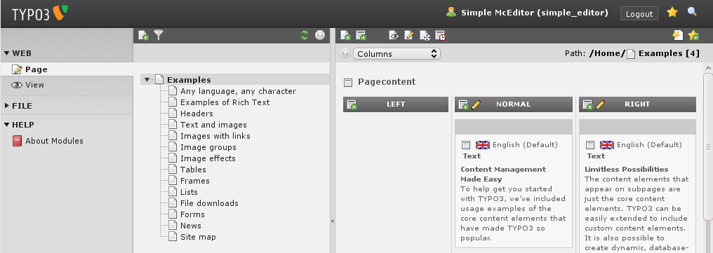
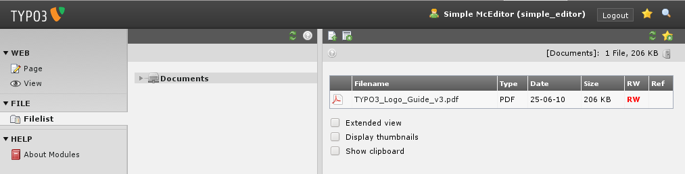
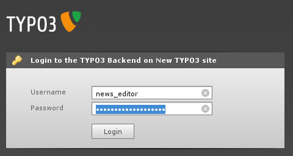
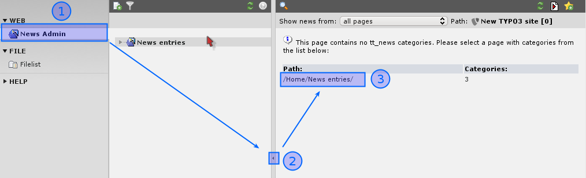
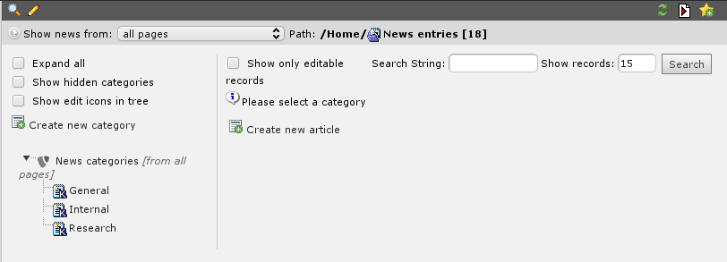
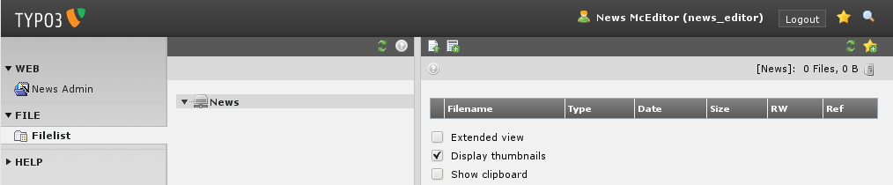
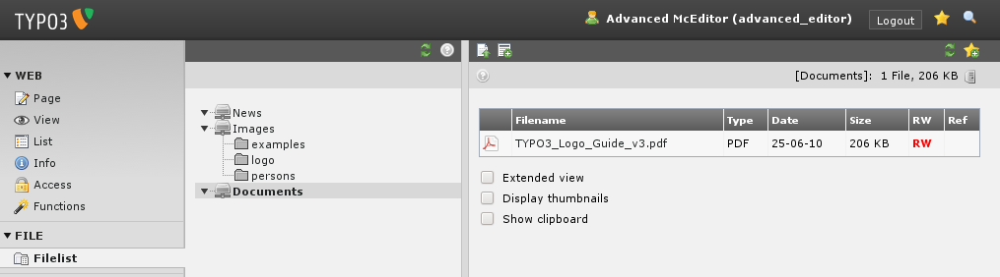

.. ==================================================
.. FOR YOUR INFORMATION
.. --------------------------------------------------
.. -*- coding: utf-8 -*- with BOM.

.. include:: ../../Includes.txt

.. _backend-users:

Backend users
^^^^^^^^^^^^^

The introduction package is shipped with four users. Let's see what
they can do. The best way to do this is to logout as admin and log in
as one of these users, one at a time.

.. _simple-editor:

"simple\_editor"
""""""""""""""""

When you log in as "simple\_editor" you will see this when you
activate the Page module and select the page "Examples" for editing:

Only the page "Examples" with its subpages. The "simple\_editor" is
allowed to edit only that branch of the website. But it does not only
reflect permission management - it also helps make the system more
intuitive and user friendly. As you can see most of the backend
modules are not shown to the simple\_editor either. The menu to the
left contains only the "Page" and "View" modules in addition to the
"File" and "Help" module.

Images and Documents are managed in the "Filelist" module. The
"simple\_editor" sees only a Folder "Documents" which is linked to the
folder fileadmin/user\_upload/documents/. So all folders he does not
need, are hidden.

.. _news-editor:

"news\_editor"
""""""""""""""

Now log in as "news\_editor".

The "news\_editor" is only responsible for writing the news. He should
not bother with all the other content of that website. The news are
managed via the News-Admin Modul. Just like the simple\_editor, he can
see only the things, he should see.

Now select the module "News Admin" (#1), close the sidebar (#2) and
select the provided path (#3). In the "News Admin" module the user can
create and edit new News.

Now check the "Filelist" module.

The "news\_editor" has an restricted view at the folder structure as
well, but he sees only documents, which are located in
fileadmin/user\_upload/news/.

.. _advanced-editor:

"advanced\_editor"
""""""""""""""""""

Now, log in as "advanced\_editor".

.. figure:: ../../Images/manual_html_m1d09baa9.png
   :alt:

The "advanced\_editor" sees much more modules and the whole page
structure. He is able to do the same as the news\_editor and the
simple\_editor and much more. So, it is possible to restrict everyone
to that modules and pages, which he needs to know. Have a look at the
Filelist module.

The "advanced\_editor" does not see the whole fileadmin folder. But he
has access to the "News", the "Documents" and another "Images" folder.