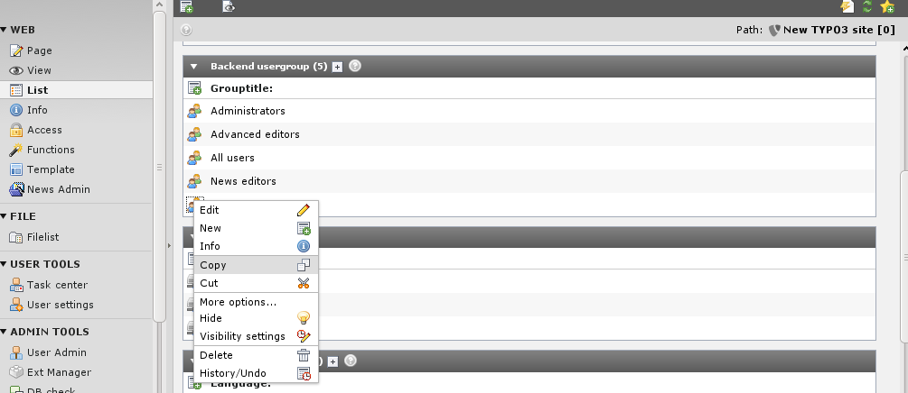
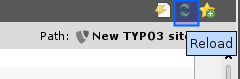
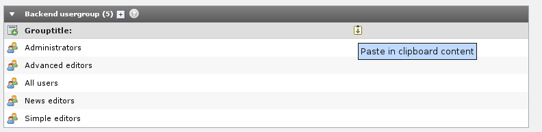
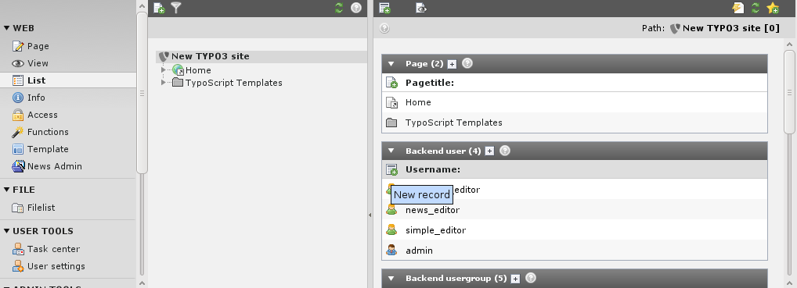
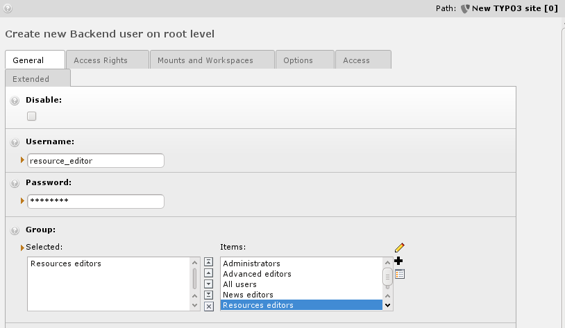
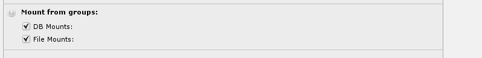
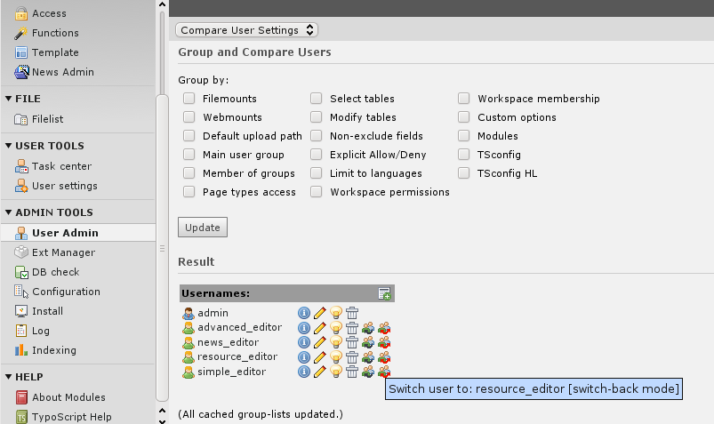
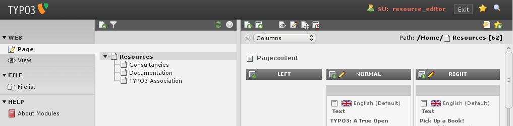

.. ==================================================
.. FOR YOUR INFORMATION
.. --------------------------------------------------
.. -*- coding: utf-8 -*- with BOM.

.. include:: ../../Includes.txt
.. include:: Images.txt

Creating a new user for the Introduction site
^^^^^^^^^^^^^^^^^^^^^^^^^^^^^^^^^^^^^^^^^^^^^

Now, we can create a user who should be in charge for the "Resources"
page including sub-pages.

Step 1: create a new User group "Resources editors"
"""""""""""""""""""""""""""""""""""""""""""""""""""

User groups and Users are just records. Copy the backend user group
record "Simple editors".

Reload the List.

And paste the copied record in the list.

Now edit the newly created backend user group "Simple
editors (copy 1)". Change the group's title and the DB mount.

.. figure:: ../../Images/manual_html_m36f2898f.png
   :alt:

Step 2: create the user
"""""""""""""""""""""""

Users are just records - create a "Backend user" record:

Enter the username, password, group membership:

Take care, that the "Mount from Groups" settings are set:

Save the record and check the new backend user with the switch-user
function in the Admin-Tool.

It works:

