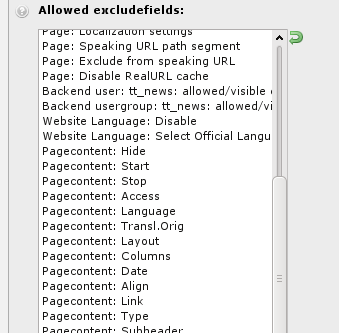
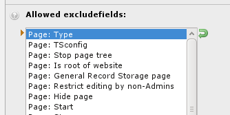

.. include:: ../../Includes.txt

.. _permissions:
.. _setting-up-user-permissions:

===========================
Setting up User Permissions
===========================

We will look into managing user permissions by editing the
"Advanced editors" user group.

.. figure:: ../../Images/BackendBackendGroupEditSettings.png
   :alt: Choosing the settings menu

.. _general:

General
=======

On the "General" tab you can edit the group's title and write a
short description. As mentioned before, permissions from sub-groups
will be inherited by the current group.

.. figure:: ../../Images/BackendBackendGroupEditGeneralTab.png
   :alt: Content of the "General" tab when editing a backend user group

.. note::

   Setting permissions is not just about access rights.

   It can also help to declutter the backend, ensuring that
   backend users only see and have access to the modules they require.

.. _access-lists:
.. _include-access-lists:

Access Lists
============

The "Access Lists" tab is where most permissions are defined.
All fields are detailed below.

.. _modules:

Modules
-------

The first field is used to define which modules members of the group
should have access to. This will directly influence what appears
in the module menu for backend users.

.. figure:: ../../Images/BackendBackendGroupEditModules.png
   :alt: Choosing modules for the backend user group

.. _tables:
.. _tables-modify:

Tables
------

The second field allows you to select the tables that the members of the
groups are allowed to see ("Tables (listing)"). And the next field is
the same but for the tables that can be modified ("Tables (modify)").

.. figure:: ../../Images/BackendBackendGroupEditTables.png
   :alt:

.. _page-types:

Page Types
----------

These fields can restrict which page types are available to members
of the group. Explanations about the various page types are
found in the :ref:`Editors Guide: <t3editors:pages-types>`.

.. figure:: ../../Images/BackendBackendGroupEditPageTypes.png
   :alt:

.. _allowed-excludefields:

Allowed Excludefields
---------------------

When defining table fields in TYPO3, it is possible to mark them
as "excluded". Such fields will never be visible to backend users
(except administrators, of course) unless they are explicitly given
access to them. This field is about granting such access. It displays
a list of all tables and their excluded fields.

Click on a table name to expand the list of its fields and make
a selection of fields by checking some boxes.

.. _explicitly-allow-deny-field-values:

Explicitly Allow or Deny Field Values
-------------------------------------

For some fields, it is possible to set fine-grained permissions
on the actual values allowed for those fields. This is in particular
the case for the "Page content: Type" field, which defines the type
of content element that can then be defined by the members of the
group.

As with the list of excluded fields, this fields first appears
with groups collapsed. You need to expand one group to start
making changes.

.. figure:: ../../Images/BackendBackendGroupEditAllowDeny.png
   :alt: Setting permissions for values of the content type field

Limit to Languages
------------------

In a multilingual web site, it is also possible to restrict users
to a specific language or set of languages. This can be achieved using the last field
of the "Access Lists" tab.

.. figure:: ../../Images/BackendBackendGroupEditLanguages.png
   :alt: Setting permissions for languages

.. _mounts:

Mounts and Workspaces
=====================

The next tab contains very important fields which define 
which parts of the page tree and the file system the members of
the group may exert their rights over.

We will cover only mounts here. Detailed information about
workspaces can be found in the :ref:`related extension manual <workspaces:start>`.

.. _db-mounts:

DB Mounts
---------

DB mounts (database mounts) are used to restrict a user's access to
only some parts of the page tree. Each mount corresponds to a page in
the tree. The user will have access only to those pages and their sub-
pages.

.. figure:: ../../Images/BackendBackendGroupEditDBMounts.png
   :alt: Choosing DB mounts for the group

See also :ref:`Pages permissions <page-permissions>`.

In order to inherit these settings in assigned users, activate the checkbox
"Mount from groups" for the "DB Mounts" in the `be_users` record of this
user. This record can be found in the "List" module on the root page and in the
"Backend User" module.

.. _file-mounts:

File Mounts
-----------

File mounts are similar to DB mounts but instead are used for manage access to files. 
The main difference is that file mount records must be defined by the administrator first.
These are located in the root node:

.. figure:: ../../Images/BackendFileMountList.png
   :alt: List of all available file mounts

They can then be selected when editing a backend user group:

.. figure:: ../../Images/BackendBackendGroupEditFileMounts.png
   :alt: Selecting allowed file mounts

.. note::

   The definition of file mount records also depends on so-called
   m
   file storages. This topic is covered in more detail in the
   :ref:`t3coreapi:fal` chapter in "TYPO3 Explained".

In order to inherit these settings in assigned users, activate the checkbox
"Mount from groups" for the "File Mounts" in the `be_users` record of this
user. This record can be found in the "List" module on the root page and in the
"Backend User" module.

.. _file-permissions:

Fileoperation Permissions
-------------------------

Giving access to File mounts is not the whole story. Specific operations
on files and directories must be allowed. This is what the next field
does. Choose either "Directory" or "Files" and start checking boxes.

.. figure:: ../../Images/BackendBackendGroupEditFilePermissions.png
   :alt: Giving specific file operation permissions
