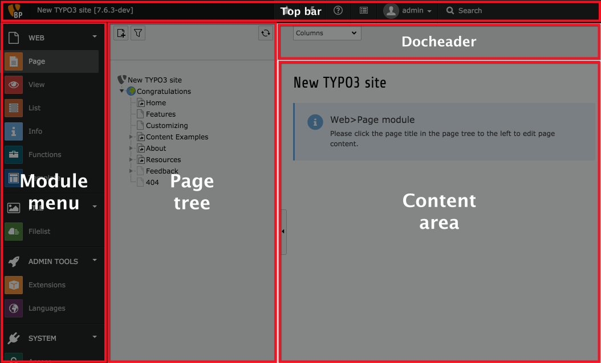

.. include:: ../../Includes.txt

.. _docheader:
.. _general-backend-structure:

Structure générale du Backend
^^^^^^^^^^^^^^^^^^^^^^^^^^^^^

Voici un aperçu complet de la structure générale de backend.

En plus du *menu des modules* et la *barre supérieure* que nous avons vu dans le chapitre précédent, nous avons maintenant au milieu l'*arborescence des pages* et à droite la (principale) zone de contenu.

On top of the *modules menu* and the *top bar* which we saw in
the previous chapter, we now have in the middle
the *page tree* and on the right the (main) *content area*.

La zone *docheader* contient les icônes d'action - comme fermer, enregistrer ou aperçu -
mais aussi des informations générales et parfois un menu déroulant avec d'autres actions.

Nous allons jeter un oeil de plus près à ces différentes parties dans les prochaines pages.
