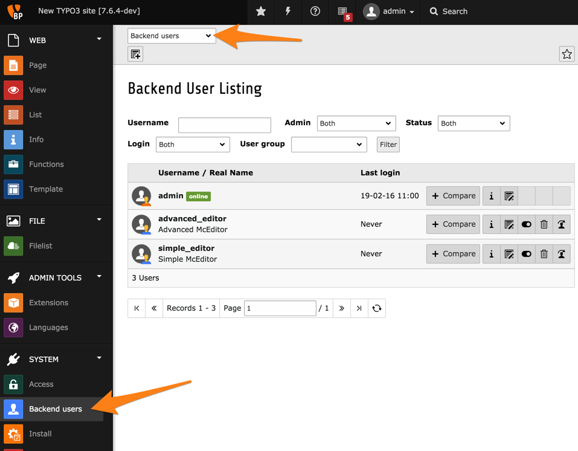

.. include:: ../../Includes.txt

.. _user-management-backend-users:

Backend users
^^^^^^^^^^^^^

Managing backend users is best done using the **SYSTEM > Backend users**
module.

The module makes it possible to search and filter users. They
can also be edited, deleted or disabled.

As you can see in the list, the Introduction Package is shipped with
two users on top of the admin users created during the installation
process. Let's take a look at what these other users can do.

.. _user-management-simple-editor:

"simple\_editor"
""""""""""""""""

The simplest way to check out another user (when one is an
administrator) is to use the "simulate user" feature:

.. figure:: ../../Images/BackendBackendUsersSimulate.png
   :alt: The last action icon lets us simulate another user

And here is what "simple\_editor" sees when accessing the
TYPO3 CMS backend:

.. figure:: ../../Images/BackendSimpleEditorUser.png
   :alt: The backend view for the "simple\_editor"

As you can see, this user only has access to the "Page" module.
Furthermore its view of the page tree is also limited to the
branch starting with the "Content examples" page.

To switch back to the admin account, click on the user's name
in the top bar and click the "Exit" button (note that this button
normally reads "Logout").

.. figure:: ../../Images/BackendBackendUsersSimulateExit.png
   :alt: Exiting the backend user simulation

.. _user-management-advanced-editor:

"advanced\_editor"
""""""""""""""""""

Now try doing the same with the "advanced\_editor". You should
see the following after switching user:

.. figure:: ../../Images/BackendAdvancedEditorUser.png
   :alt: The backend view for the "advanced\_editor"

The "advanced\_editor" is allowed to use more modules than
"simple\_editor" but doesn't have any access to the page tree.
This is probably a bug of the Introduction Package, but it makes
for a good exercise for changing user rights in the next chapters.

.. note::

   User records can also be accessed using the **WEB > List** module
   and clicking on the root node (the one with the TYPO3 CMS logo).

   .. figure:: ../../Images/BackendBackendUsersList.png
      :alt: Viewing backend users in the List module
